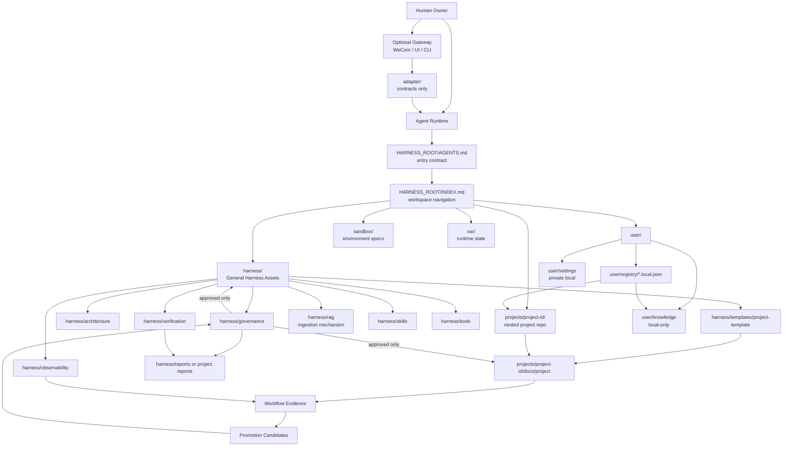
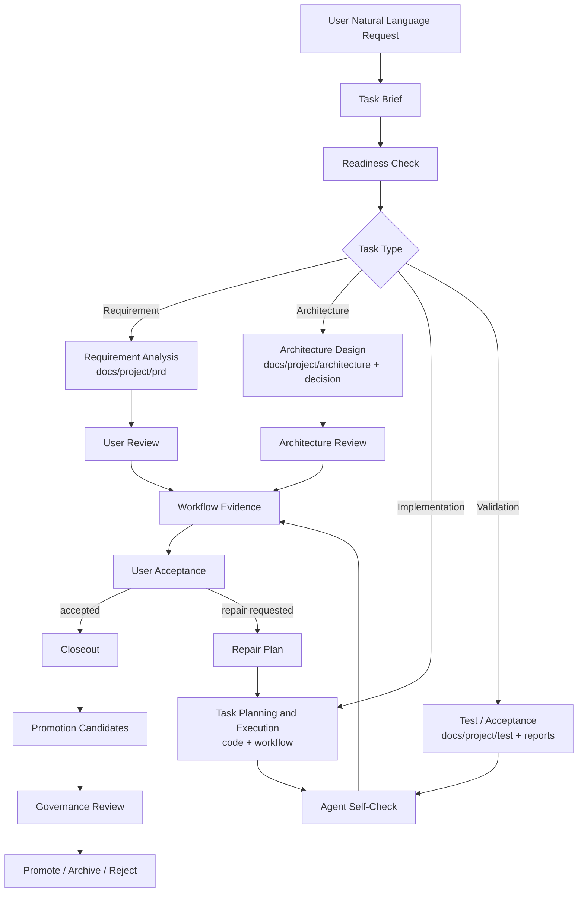
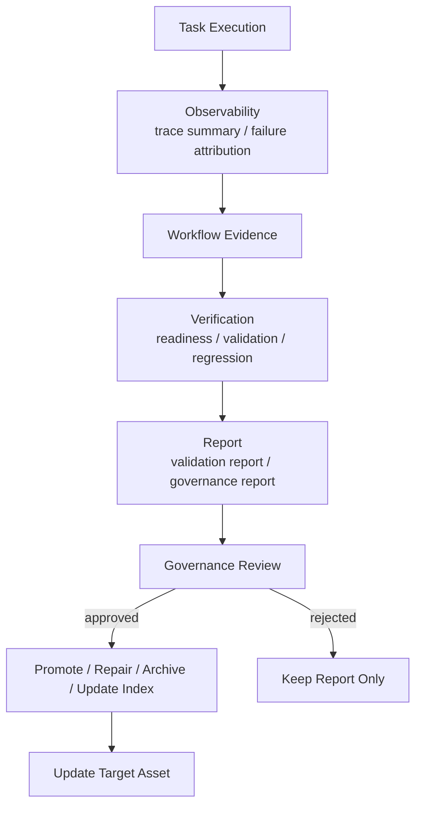
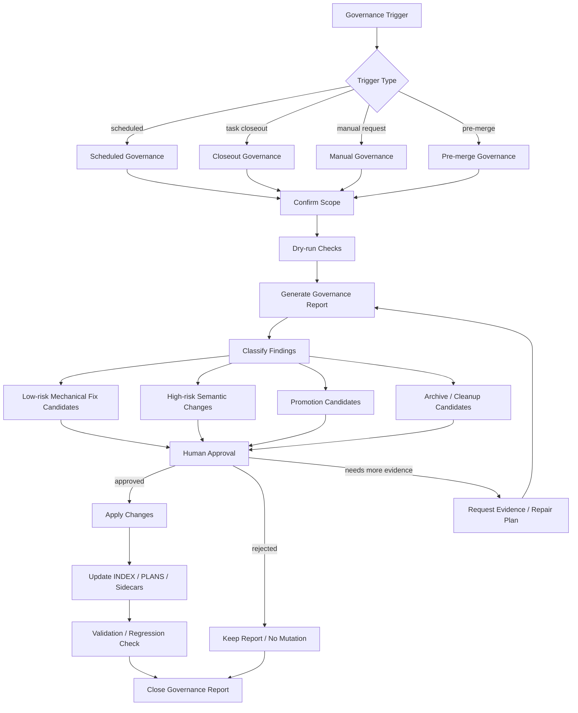
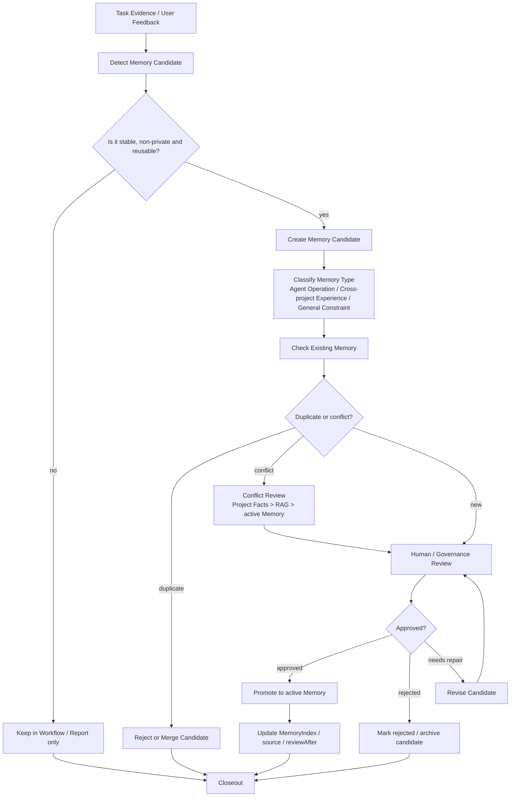
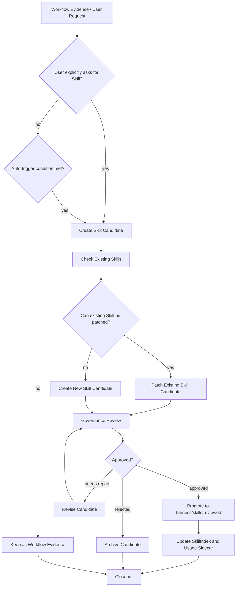
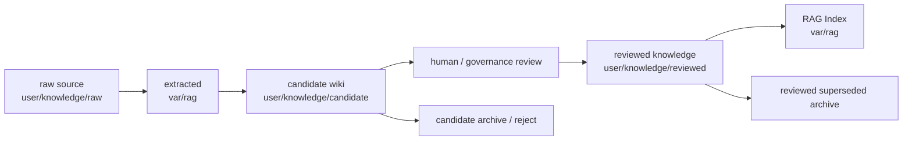

---
documentName: harness/architecture/HarnessEngineering.md
title: Harness Engineering 目标架构设计方案
aliases:
  - HarnessEngineering
  - Harness Architecture
  - Harness 自动化框架架构
tags:
  - harness
  - architecture
  - agent
  - governance
  - target-architecture
version: v2.9.0-normalized-source-depth-governance
updatedAt: 2026-07-04 00:00:00.000 +08:00
status: active
purpose: 定义 Harness Distribution Repo、Harness Workspace、Project Instance、治理闭环、项目模板、Memory、Skill、RAG、Tool、Report 等长期目标架构边界。
scope:
  - harness-root-architecture
  - agent-entry-contract
  - project-template
  - project-lifecycle
  - governance-runtime
  - memory-skill-rag-tool-boundary
  - git-boundary
prerequisites:
  - AGENTS.md
  - INDEX.md
relatedDocuments:
  - INDEX.md
  - harness/HarnessIndex.md
  - harness/architecture/PLANS.md
  - harness/governance/GovernanceIndex.md
  - harness/rag/policies/ObsidianLlmWikiPluginBoundary.md
  - harness/rag/policies/CandidatePostPromotionCleanupPolicy.md
  - harness/rag/policies/LlmWikiMechanismAbsorptionPolicy.md
  - harness/templates/project-template/docs/project/ProjectIndex.md
outputTo:
  - harness/architecture/HarnessEngineering.md
owner: mixed
reviewAfter: 2026-07-17
supersededBy:
dependsOn:
  - AGENTS.md
  - INDEX.md
  - harness/HarnessIndex.md
supersedes:
  - v2.3.0-feedback-23-integrated-review
review:
  reviewedBy: user
  reviewedAt: 2026-07-03
  decision: normalized-source-depth-governance-updated
  notes: 固化项目入口、RAG/Knowledge、索引、计划、产品化目标、真实项目生命周期证据脚本门禁、LLM Wiki 风格知识库治理模型、source-centered candidate archive 结构、Knowledge one-click validation gate 命令面、Obsidian LLM Wiki 插件边界策略、candidate post-promotion cleanup、obsidian-llm-wiki 可复用机制、normalized source boundary 和 reviewed source depth 门禁。
---

# Harness Engineering 目标架构设计方案

## 0. 文档定位

本文定义 `<HARNESS_ROOT>` 的长期目标架构、边界、目录模型、Git 管理规则、Agent 入口契约、项目实例模型、项目模板结构、自动治理闭环、RAG 摄取机制、Memory/Skill 机制和生命周期、工具资产边界、任务执行闭环和用户审核闭环。

本文是 Harness 架构的唯一长期权威文档。

- 长期架构正文只维护在：`harness/architecture/HarnessEngineering.md`
- 全局导航入口只维护在：`INDEX.md`
- General Harness 资产分层索引只维护在：`harness/HarnessIndex.md`
- Harness 架构建设计划、验收计划、长期优化和更新计划只维护在：`harness/architecture/PLANS.md`
- 项目级 Agent 入口只维护在：`projects/<project-id>/AGENTS.md`
- 项目实例事实入口只维护在：`projects/<project-id>/docs/project/ProjectIndex.md`

本文描述目标组织结构和长期架构规则，不记录：

- 具体项目事实正文；
- 用户私有知识库正文；
- 一次性任务过程；
- Harness 计划验收证据；
- 本机私有配置；
- token、password、auth、settings.xml 或本机绝对路径。

---
## 1. 文档类型与状态规范

### 1.1 文档状态与资产状态分离

Harness 同时管理“文档”和“资产”。二者状态不能混用。

文档状态用于描述一个 Markdown 文档自身是否稳定：

```text
draft -> review -> active -> stale -> deprecated -> archived
                    -> superseded
```

资产状态用于描述某个候选资产是否被采纳：

```text
candidate -> approved -> rejected -> archived
```

约束：

- `frontmatter.status` 只使用文档状态；
- 资产候选状态写在文档正文或 `assetState` / `review` 字段中；
- `reviewed` 表示审查结果，不作为 `frontmatter.status`；
- `active` 表示当前有效文档，不等同于候选资产已批准；
- `candidate` 不作为通用文档状态，除非该文档本身是候选资产文档。

推荐 review 字段：

```yaml
review:
  reviewedBy: human | agent | mixed
  reviewedAt:
  decision: approved | rejected | needs-repair
  notes:
```

### 1.2 重要文档基础 frontmatter

所有重要文档应包含 YAML frontmatter。推荐基础字段：

```yaml
documentName:
version: v1.0.0
updatedAt: 2026-06-17 10:30:00.000 +08:00
status: draft | review | active | stale | deprecated | archived | superseded
purpose:
scope:
prerequisites:
relatedDocuments:
outputTo:
owner: human | agent | mixed
reviewAfter:
supersededBy:
dependsOn:
review:
  reviewedBy:
  reviewedAt:
  decision:
```

| 文档状态 | 含义 |
|---|---|
| `draft` | 草稿，尚未稳定。 |
| `review` | 等待人工或治理审查。 |
| `active` | 当前有效。 |
| `stale` | 可能过期，需要审查。 |
| `deprecated` | 明确不推荐继续使用，但暂未删除。 |
| `archived` | 已归档，默认不参与上下文加载。 |
| `superseded` | 已被其他文档替代。 |

### 1.3 文档类型与输出位置

| 文档类型 | 作用 | 默认位置 | 是否事实源 |
|---|---|---|---|
| Architecture | 架构权威与边界定义 | `harness/architecture/` | 是，限 Harness 架构事实 |
| Index | 导航入口 | `INDEX.md`、`harness/HarnessIndex.md`、`ProjectIndex.md` | 是，限路由事实 |
| Plan | 建设计划、验收计划、长期优化计划 | `harness/architecture/PLANS.md` | 否，不替代架构正文 |
| Policy / Governance | 治理规则 | `harness/governance/` | 是，限治理规则 |
| Template | 可复制模板 | `harness/templates/` | 是，限模板结构 |
| Project Fact | 项目事实 | `projects/<project-id>/docs/project/` | 是，限项目实例 |
| Workflow Evidence | 任务过程证据 | `projects/<project-id>/docs/project/workflow/` | 否，默认不晋升 |
| Report | 检查、验证、治理输出证据 | `harness/reports/` 或 `projects/<project-id>/docs/project/reports/` | 否，需人工确认后写入事实源 |
| Skill | 可复用流程 | `harness/skills/` | 是，限 procedural workflow |
| Memory | 通用化经验 | `harness/memory/` | 是，限通用化、非私有经验 |
| Knowledge | 用户或领域知识 | `user/knowledge/` 或外部 private knowledge repo | 是，限知识库作用域 |
| Tool Asset | 工具说明、manifest、稳定脚本 | `harness/tools/` | 是，限工具契约 |
| Observability Schema | Trace 和失败归因结构 | `harness/observability/` | 是，限记录结构 |
| Verification Policy | readiness、validation、regression 规则 | `harness/verification/` | 是，限验证规则 |

---

## 2. 背景和核心定义

### 2.1 背景

随着智能体逐渐参与代码开发、架构分析、测试设计、文档维护、复现排查和长期项目治理，用户与智能体协作中存在几个典型问题：

1. **文档入口不统一**：智能体不知道先读什么；
2. **资产混叠**：项目事实、任务历史、知识库、记忆、经验总结混在一起；
3. **缺少生命周期管理**：文档缺少状态、版本、更新时间、过期审查和归档机制；
4. **污染风险**：长期任务中 Skill 和 Memory 容易被一次性信息污染；
5. **复制困难**：新项目很难快速复制一套可被智能体稳定读取和维护的文档系统；
6. **上下文坍塌**：长程任务中，上下文窗口限制导致关键信息丢失；
7. **交付闭环不稳定**：需求、架构、任务、验证、用户审核和治理晋升之间缺少统一证据链。

因此，需要建立一套通用 Harness Engineering 文档资产架构，用于约束、组织和治理智能体协作开发过程中的项目上下文。

### 2.2 Harness Engineering 核心定义

Harness Engineering 是面向 Agent Runtime 协作开发的项目上下文治理系统。

Codex、Hermes 等 Agent Runtime 负责推理、用户交互、工具调用、文件修改、命令执行和会话管理。Harness 为 Agent Runtime 执行项目任务提供统一入口、索引、上下文路由、项目文档结构、任务证据链、工具资产、知识摄取机制、Memory/Skill 治理、自动治理检查和验收闭环，使任何智能体都可以稳定理解项目、制定计划、执行任务、检查验收标准，并将可复用经验沉淀为长期项目能力。

Harness 的目标不是做纯文档系统，也不是把 Agent Runtime 内核纳入本仓库。它是让 Agent 可以稳定、安全、可审计地完成项目自动化工作的控制层。

Harness 同时具备两种身份：

1. **通用 Harness / General Harness**：`harness/` 下的通用文档系统和治理资产，保存架构、治理、模板、技能、记忆规则、工具说明、报告和验证规则。
2. **项目实例 / Project Instance**：`projects/<project-id>/` 下的受管工作副本，保存项目事实、项目文档、项目 workflow evidence 和项目级验收。

### 2.3 通用 Harness 不实现的内容

通用 Harness 不实现：

- LLM 内核或 Agent Runtime；
- 模型调用封装；
- Agent Runtime 工具调度；
- 与 Claude Code、Hermes、OpenClaw、Codex 或其他具体智能体工具的强绑定；
- 真实项目代码作为通用 Harness 资产；
- 用户知识库作为通用 Harness 资产；
- 用户仓库账号信息、私有 settings、本机绝对路径、token、password、credential。

### 2.4 Harness 的核心职责

Harness 的核心职责是：

1. 定义 Agent 进入工作区后的强制入口；
2. 定义通用 Harness 资产和项目实例资产的边界；
3. 定义项目从需求分析、架构设计、任务规划、任务执行、任务自检、用户审核到治理晋升的闭环；
4. 定义稳定工具、脚本、模板、Skill、Memory、RAG 机制的治理规则；
5. 定义 Project Fact、Workflow Evidence、Knowledge、Memory、Skill、Report 的晋升和归档规则；
6. 定义 dry-run、report-first、human approval 的自动治理机制；
7. 保证 Harness 可以作为可下载、可植入、跨平台、跨机器复用的通用 Git 仓库使用。

### 2.5 已吸收的长期设计原则

以下原则来自既有 Harness 实践，并经用户确认后吸收到长期目标架构中。它们只作为长期架构规则，不携带具体项目事实、本机路径或阶段状态。

1. **安全边界优先**：凭据、私有 settings、auth、私有仓库信息、本机绝对路径和未脱敏日志不得进入通用 Harness Git、prompt、Task Brief、workflow summary、Knowledge、Memory 或 Skill。
2. **项目独立 Git**：`projects/<project-id>/` 下的真实项目是独立 Git 仓库或本地工作区，不混入 Harness Distribution Repo 的 Git history。
3. **Workflow Evidence 分离**：复杂任务必须形成 workflow evidence，但 evidence 只产生候选，不自动成为 Project Fact、Knowledge、Memory、Skill 或架构规则。
4. **稳定工具分层**：稳定工具必须具备输入输出契约、脱敏日志路径、失败模式和修复建议；一次性脚本不能自动晋升为 stable tool。
5. **Governance Self-Check**：治理检查应覆盖索引完整性、frontmatter、Git 边界、敏感边界、stale 文档和候选资产，但默认 dry-run、report-first。
6. **Project Lifecycle Evidence Gate**：真实项目任务的方案设计、开发、验证、报告、审核和验收闭环不能只依赖 Skill、Mermaid 或人工描述；必须存在可执行的只读脚本门禁，用于检查项目 workflow evidence 和项目 report 是否覆盖必要证据。
7. **本地 Registry 路由**：本机 registry 只保存路由 metadata，不复制项目事实、私有 settings、真实仓库 URL 或运行日志。
8. **本地 Settings 边界**：工具可以按 allowlist 传递 settings 路径，但默认不得读取、打印或写入 settings 正文。

### 2.6 从真实项目反向优化 Harness

通用 Harness 确定智能体解决真实项目所需要遵循的模板和规则。同时，在完成真实项目过程中，可以反向优化 Harness 文档系统自身。

反向优化必须遵守：

```text
真实项目任务证据
-> Promotion Candidate
-> Governance Review
-> Human Approval
-> 选择目标资产
-> 更新目标文档和索引
-> 记录来源和 reviewAfter
-> closeout
```

真实项目中的通用经验可以沉淀为 Skill、Memory、Template、Tool、Governance Rule 或 Project Template 改进；真实项目相关知识应沉淀到 `user/knowledge/project-id/` 或外部 private knowledge repo，而不是直接进入通用 Harness Git。

---

## 3. 术语

| 中文术语 | English | 定义 |
|---|---|---|
| 智能体运行时 | Agent Runtime | Codex、Hermes 等外部执行主体。 |
| 通用 Harness | General Harness | `harness/` 下的通用文档系统和治理资产。 |
| Harness Distribution Repo | Harness Distribution Repo | 可下载、可植入、跨机器复用的通用 Harness Git 仓库。 |
| Harness Workspace | Harness Workspace | 某台机器上 clone Harness Distribution Repo 后形成的实际工作区，即 `<HARNESS_ROOT>`。 |
| 项目实例 | Project Instance | `projects/<project-id>/` 下的项目工作副本和项目事实。 |
| 项目模板 | Project Template | Harness 中用于生成项目文档系统的结构蓝图，位于 `harness/templates/project-template/`。 |
| 任务简报 | Task Brief | Agent 从自然语言提示词整理出的任务目标、范围、验收和风险说明。 |
| 工作流证据 | Workflow Evidence | 项目级任务过程、工具调用、验证和结论证据。 |
| 治理 | Governance | 对 Knowledge、Memory、Skill、Project Fact、Template、Tool 和 Report 的 review、晋升、归档和清理机制。 |
| 验证 | Verification | 验证任务是否具备执行条件、是否通过验收、修复后是否回归通过。 |
| 观测 | Observability | 记录任务执行过程中的 trace、event、failure、cost、human intervention 摘要结构。 |
| 报告 | Report | Governance、Verification、Observability 的输出证据，不是事实源。 |
| 知识 | Knowledge | 经 review、带来源、作用域、staleness 和治理记录的事实性信息。 |
| 记忆 | Memory | 可复用、已通用化的经验，不等同于知识或任务历史。 |
| 技能 | Skill | 可复用工作流或操作过程，不等同于知识。 |
| 检索增强生成 | RAG | Retrieval-Augmented Generation。RAG Index 是可重建检索产物，不是事实源。 |
| 知识库 Wiki | Knowledge Wiki | 面向人类和 Agent 的 Markdown 知识库界面，通过 schema、index、wikilink、source trace 和 lint 规则维护知识图谱。 |
| 工具资产 | Tool Asset | 可重复、可审计、被文档化的脚本、命令表面或工具说明。 |

---

## 4. 根模型与导航模型

### 4.1 Harness Distribution Repo

Harness Distribution Repo 是可下载、可植入、跨机器复用的通用 Harness Git 仓库。

它保存：

- 智能体唯一入口文档 `AGENTS.md`；
- 全局导航 `INDEX.md`；
- Harness 架构文档、架构计划文档和 Harness 索引；
- 通用治理规则、通用记忆规则、项目生命周期和验收闭环规则；
- 为新项目提供可复制通用模板；
- 稳定脚本、Skill、Tool、Memory 规则和非私有通用经验；
- RAG 摄取机制、schema、pipeline、eval 模板；
- adapter 契约和规范；
- sandbox 规范；
- README、LICENSE、bootstrap 文档。

它不保存：

- 真实项目代码；
- 真实项目文档；
- 真实用户知识库；
- 用户私有配置；
- 本机路径映射；
- 运行日志、cache、tmp、embedding index；
- token、password、server credential、Maven settings、GitHub auth。

### 4.2 Harness Workspace

Harness Workspace 是某台机器上 clone Harness Distribution Repo 后形成的实际工作区，即 `<HARNESS_ROOT>`。

`<HARNESS_ROOT>` 同时具备两种身份：

1. 它是通用 Harness Git 仓库的 checkout 根目录；
2. 它也是本机 Agent 工作区的根目录。

因此，`<HARNESS_ROOT>` 下会同时出现 tracked universal assets 和 local-only runtime assets。二者必须通过 `.gitignore`、目录边界和治理规则严格隔离。

### 4.3 Project Repo / Project Instance

Project Repo / Project Instance 是 `projects/<project-id>/` 下的真实项目仓库。

每个项目实例通常是一个独立 Git 仓库。它可以保存真实项目代码、项目背景需求文档、项目 workflow evidence、项目验收结果和项目决策记录。

`projects/<project-id>/` 不属于通用 Harness Git 历史。Harness 只通过 `user/registry/projects.local.json`、项目根 `AGENTS.md` 和 `docs/project/ProjectIndex.md` 读取和治理项目。

### 4.4 导航权威边界

```text
<ROOT>/INDEX.md
= 全局导航入口，给人和 Agent 找路。

harness/HarnessIndex.md
= General Harness 资产分层索引，链接 architecture/governance/rag/memory/skills/tools/templates/verification/observability。

harness/architecture/PLANS.md
= Harness 架构建设计划、验收计划、长期优化和更新计划，不记录具体项目计划。

projects/<project-id>/docs/project/ProjectIndex.md
= 项目实例事实入口。
```

约束：

- `INDEX.md` 不直接替代 `HarnessIndex.md`；
- `HarnessIndex.md` 不记录具体项目事实；
- `PLANS.md` 不记录一次性 workflow evidence；
- `ProjectIndex.md` 不记录通用 Harness 架构权威；
- 新增、迁移、归档任何长期文档后，必须同步对应层级索引。

---

## 5. 顶层架构图

注意：Mermaid 节点中不直接使用 `<project-id>` 或 `<HARNESS_ROOT>`，避免渲染异常。图中使用 `HARNESS_ROOT` 和 `projects/project-id/` 作为显示文本。


关键解释：

- Agent 进入 `<HARNESS_ROOT>` 后，唯一强制入口是根目录 `AGENTS.md`。
- `adapter/` 是契约层，不是运行时实现。
- `harness/rag/` 是通用知识摄取机制，不保存真实用户知识。
- `user/` 是本机用户边界，不进入通用 Git。
- `projects/` 是真实项目挂载区，下面每个项目独立 Git 管理。
- `var/` 是运行态、cache、索引、日志和临时证据，不进入 Git。
- `harness/governance/` 是自动检查、报告、审查和晋升闭环，不是无审查后台写入机制。
- 项目证据和用户知识不能直接污染通用 Harness，必须走 candidate-first、review-first、human approval。

---

## 6. 目标组织结构

采用“顶层边界 + harness 内部资产层”。

```text
<HARNESS_ROOT>/
  .git/
  .gitignore
  AGENTS.md
  INDEX.md
  README.md
  LICENSE

  adapter/
    AdapterIndex.md
    task-intake/
    runtime-adapters/
    gateways/
    result-contracts/
    agents/
      AgentProfileContract.md
      AgentCapabilityContract.md

  harness/
    HarnessIndex.md

    architecture/
      HarnessEngineering.md
      PLANS.md
      CHANGELOG.md

    governance/
      GovernanceIndex.md
      ArtifactLifecycle.md
      ScheduledGovernance.md
      KnowledgePromotionPolicy.md
      MemoryGovernance.md
      SkillGovernance.md
      DocumentGovernance.md
      IndexMaintenancePolicy.md
      CleanupPolicy.md
      ReportArchivePolicy.md

    rag/
      RAGIndex.md
      manifests/
      pipelines/
      evals/
      policies/

    memory/
      MemoryIndex.md
      MemoryPolicy.md
      MemoryTemplate.md
      candidate/
      reviewed/
      archive/

    observability/
      ObservabilityIndex.md
      TraceSchema.md
      FailureAttribution.md

    reports/
      ReportsIndex.md
      governance/
      verification/
      index/
      archive/

    skills/
      SkillIndex.md
      SkillPolicy.md
      candidate/
      reviewed/
      archive/
      usage/
        skill-usage.example.json

    templates/
      TemplatesIndex.md
      WorkflowTemplate.md
      ReportTemplate.md
      SkillTemplate.md
      MemoryTemplate.md
      ADRTemplate.md
      GovernancePolicyTemplate.md
      KnowledgeTemplate.md
      project-template/
        README.md
        AGENTS.md
        docs/project/
          ProjectIndex.md
          ProjectProfile.example.yaml
          ValidationProfile.example.yaml
          SourceLayout.md
          Validation.md
          TestStrategy.md
          SensitiveBoundaries.md
          Acceptance.md
          prd/
            PRD.md
          architecture/
            Architecture.md
          dictionary/
            SemanticDictionary.md
          git/
            Repository.md
          api/
            Api.md
          data/
            Data.md
          test/
            Test.md
          workflow/
            README.md
          decision/
            ADR-0001.md
          model/
            README.md
          reports/
            README.md
        model/
          README.md
          ProjectTemplateGuide.md
          StandardProjectPackage.md
          ProjectInstanceModel.md
          ProjectRegistrationModel.md

    tools/
      ToolsIndex.md
      docs/
      manifests/
      scripts/
        stable/
        candidate/
        runtime/
        historical/
      external/

    verification/
      VerificationIndex.md
      ReadinessCheckPolicy.md
      RegressionPolicy.md
      HarnessValidationCases.md

  projects/
    README.md
    .gitkeep
    <project-id>/
      .git/
      <real-project-files>
      AGENTS.md
      docs/project/
        ProjectIndex.md
        prd/
        architecture/
        dictionary/
        git/
        api/
        data/
        test/
        workflow/
        decision/
        model/
        reports/

  sandbox/
    SandboxIndex.md
    profiles/
    policies/
    environment/
    setting-boundary/

  user/
    README.md
    registry/
      projects.local.example.json
      knowledge.local.example.json
    knowledge/
      README.md
      raw/
      extracted/
      candidate/
      reviewed/
      archive/
    settings/
      README.md
      maven/

  var/
    logs/
    cache/
    tmp/
    evidence/
    rag/
```

### 6.1 目录口径

- RAG 机制统一放在 `harness/rag/`，不再设置顶层 `rag/`。
- Tool 资产统一放在 `harness/tools/`，不再设置顶层 `tools/`。
- Project Template 统一放在 `harness/templates/project-template/`。
- 真实项目文档统一放在 `projects/<project-id>/docs/project/`，不占用整个 `docs/`。
- `git/Repository.md` 是项目仓库规则文档，不是 `.git/` 目录。
- `.git/` 是真实 Git 仓库元数据目录，不受 Harness 文档模板管理。
- `user/knowledge/` 是真实用户知识库本地位置，不进入通用 Harness Git。
- 不设置 `user/memory/`。短期内 Memory 只保留一套机制，位于 `harness/memory/`；不够通用或包含用户私有偏好的内容不得晋升为长期 Memory。

---

## 7. Git 管理分类

Git 管理先按内容类型定义，再给 `.gitignore` 基线。具体文件规则必须服从内容类型边界。

### 7.1 可进入 Harness Distribution Repo 的内容类型

```text
- 通用架构文档；
- 通用索引；
- 通用治理规则；
- 通用项目模板结构；
- 通用模板正文；
- 通用 Skill 定义；
- 通用 Memory 规则和非私有示例；
- 通用 RAG 摄取机制；
- adapter 契约；
- verification / observability schema；
- 工具文档、manifest、稳定脚本；
- example registry；
- README / LICENSE / bootstrap docs。
```

### 7.2 禁止进入 Harness Distribution Repo 的内容类型

```text
- 真实项目代码；
- 真实项目文档；
- 用户真实知识库；
- 本机路径映射；
- 用户私有 settings；
- 凭据、token、auth；
- runtime logs/cache/tmp；
- generated index / embedding；
- 外部二进制和大文件；
- 未脱敏 trace。
```

### 7.3 应独立 Git 管理的内容

```text
- projects/<project-id>/：每个真实项目自己的 Git repo；
- user/knowledge/：如需远程同步，应是用户自己的 private repo；
- 大型工具或外部依赖：独立 repo 或 package，不混入 Harness。
```

### 7.4 默认 local-only 的内容

```text
user/registry/*.local.json
user/settings/**
user/knowledge/**
var/**
projects/*
```

说明：目标架构不设置 `user/memory/`。如果未来需要多用户或用户偏好记忆，再通过新阶段设计 `user/<user-id>/memory/` 或外部 private memory repo；当前不纳入 Harness 目标。

### 7.5 推荐 `.gitignore` 基线

```gitignore
# Real project repos are nested independent repos or local workspaces.
/projects/*
!/projects/README.md
!/projects/.gitkeep

# Local user boundary.
/user/**
!/user/README.md
!/user/registry/
!/user/registry/*.example.json
!/user/knowledge/
!/user/knowledge/README.md
!/user/settings/
!/user/settings/README.md

# Runtime state.
/var/**
/sandbox/runtime/**
/sandbox/tmp/**

# Tool runtime and external assets.
/harness/tools/scripts/runtime/**
/harness/tools/external/**

# RAG runtime artifacts.
/var/rag/**

# Secrets and local configs.
*.secret
*.token
*.key
*.pem
settings.xml
.env
```

---

## 8. AGENTS.md 入口契约

`<HARNESS_ROOT>/AGENTS.md` 是 Agent 进入 Harness Workspace 后的唯一强制入口契约。它只保存入口契约、硬约束和读取顺序；不是知识库、不是 Memory、不是项目事实库、不是任务历史库，也不保存 Harness 落地计划。

### 8.1 AGENTS.md 应承载

1. 根目录定义：

```text
cwd = <HARNESS_ROOT>
HARNESS_ROOT = <HARNESS_ROOT>
```

2. Harness 读取顺序：

```text
1. AGENTS.md
2. INDEX.md
3. 如果是 Harness 架构/治理/迁移任务，读取 harness/architecture/PLANS.md
4. 由 INDEX.md 路由到任务相关层级索引
5. 再读取具体 policy/template/skill/tool/project 文档
```

3. 最高优先级硬约束：

```text
当用户任务与 AGENTS.md 冲突时，Agent 必须显式报告冲突点、风险和建议处理方式。
只有用户明确批准本次例外后，Agent 才能继续执行。
该例外只对当前任务有效，不自动修改 AGENTS.md。
```

4. 任务接入规则：

用户提示词是自然语言，不要求用户填写固定模板。Agent 应把提示词整理为 Task Brief，至少记录：

```text
- 目标；
- projectId；
- 范围；
- 验收标准；
- 验证计划；
- 缺失关键字段；
- 推断字段和来源；
- 风险等级；
- 是否需要审批。
```

### 8.2 Project AGENTS.md 定位

`projects/<project-id>/AGENTS.md` 是项目级 Agent 入口契约。它用于记录每个项目定制化的技术栈、全局约束、重要规则、敏感边界、验证入口和项目级读取顺序，并路由到 `docs/project/ProjectIndex.md`。

项目根 `AGENTS.md` 不替代 `ProjectIndex.md`，不保存完整项目事实、任务历史、运行日志、私有 settings、真实仓库凭据或一次性任务证据。

### 8.3 AGENTS.md 不应承载

```text
- 具体项目知识或文档内容；
- 具体 Harness policy 正文；
- 任务历史；
- 具体记忆；
- 大段代码、临时文件、日志；
- Harness 落地或者更新计划；
- Agent Runtime 专属配置；
- 用户隐私和高风险信息。
```

---

## 9. Adapter Layer

`adapter/` 是用户、gateway 和 Agent Runtime 的交互适配层。

它包含：

- `adapter/task-intake/`：自然语言到 Task Brief 的接入模型；
- `adapter/runtime-adapters/`：Codex、Hermes 等 runtime 的执行契约；
- `adapter/gateways/`：WeCom、UI、CLI 等外部入口契约；
- `adapter/result-contracts/`：最终回复和证据路径契约；
- `adapter/agents/`：Agent profile 和 capability contract。

`adapter/agents/` 只保存：

```text
adapter/agents/
  AgentProfileContract.md
  AgentCapabilityContract.md
```

禁止把真正的 prompt policy、skill policy、memory policy 放入 `adapter/agents/`。这些内容必须分别进入：

```text
harness/governance/
harness/skills/
harness/memory/
harness/templates/
```

Adapter 只定义交互和契约，不实现 Agent Runtime 内核、不实现 gateway service、不保存 token 或 webhook secret。

---

## 10. General Harness、Project Template、Project Instance 边界

### 10.1 三层定义

```text
Harness
= 通用控制层，保存规则、模板、治理、入口、索引、工具契约。

Project Template
= Harness 中用于生成项目文档系统的结构蓝图。

Project Instance
= 根据 Project Template 实例化后的真实项目文档和事实源。
```

### 10.2 Project Template 与模板正文

目标架构采用“模板集中维护”口径：

```text
harness/templates/
= 可复制模板统一入口。

harness/templates/project-template/
= 可复制项目模板和项目文档系统蓝图。

projects/<project-id>/docs/project/
= 实例化后的项目事实源和任务证据。
```

约束：

- `harness/templates/project-template/` 只提供结构说明、字段说明、分区规则和实例化规则；
- `projects/<project-id>/docs/project/` 才能写入具体项目事实；
- 可复制正文模板统一由 `harness/templates/` 维护；
- `Project Template` 不保存真实项目需求、真实架构、真实接口、真实构建命令或真实仓库地址。

---

## 11. Project Template

Project Template Layer 是 Harness 的核心模块之一，不能退化为轻量 ProjectProfile 文档。它必须支持一个真实项目开发从需求、架构、接口、数据、测试、workflow 到决策记录的长期治理。

### 11.1 模板目标

通用模板路径：

```text
harness/templates/project-template/
```

真实项目实例路径：

```text
projects/<project-id>/docs/project/
```

通用 Project Template 只提供结构说明、字段说明、分区规则和实例化规则，不保存任何具体项目事实。

### 11.2 模板子模块

| 分区 | 作用 | 典型内容 |
|---|---|---|
| `prd/` | 需求事实源 | 产品需求、用户场景、验收标准、需求变更。 |
| `architecture/` | 架构事实源 | 架构定位、目标、系统边界、架构图、模块分层、核心对象、关键流程、架构约束、ADR 索引。 |
| `dictionary/` | 语义事实源 | 术语、命名、字段、状态、流程、同义词归一、禁用术语。 |
| `git/` | 仓库协作规则 | 仓库 URL 占位、分支策略、构建命令、测试命令、提交/PR 边界。 |
| `api/` | 接口事实源 | 接口定义、请求响应、错误码、鉴权、兼容性、接口变更。 |
| `data/` | 数据事实源 | 数据模型、数据源、字段约束、数据流、数据质量、数据变更。 |
| `test/` | 测试和验收事实源 | 测试策略、测试数据、测试报告、验收标准、质量门禁。 |
| `workflow/` | 任务过程证据 | 任务目标、上下文、计划、执行 trace、验收、自检。 |
| `decision/` | 架构决策记录 | ADR、重大技术选择、替代方案、用户审批。 |
| `model/` | 可选模型/领域模型 | 领域模型、状态机、流程模型、对象模型。 |
| `reports/` | 项目级报告 | 验证报告、治理报告、索引报告、问题报告。 |

### 11.3 `git/` 与 `.git/` 的区别

```text
git/
= Harness 项目文档分区，用于记录仓库协作规则。

.git/
= Git 工具生成的仓库元数据目录，真实项目独立 Git 仓库使用，不是 Harness 文档模板。
```

真实仓库 URL、真实分支、真实构建命令只能在项目实例中填写，不能写进通用模板。

### 11.4 Project Template 禁止事项

通用 Project Template 中不得写入：

1. 具体项目需求；
2. 具体业务架构；
3. 真实仓库 URL；
4. 真实分支名称；
5. 真实构建命令；
6. 真实接口、数据表或代码路径；
7. 真实任务历史；
8. 项目级 Memory 或 Skill；
9. 与 `harness/templates/**` 重复的可复制模板正文。

---

## 12. Project Instance

### 12.1 项目实例结构

项目实例位于：

```text
projects/<project-id>/
```

项目事实入口位于：

```text
projects/<project-id>/docs/project/
```

推荐结构：

```text
projects/<project-id>/
  .git/
  <real-project-files>
  AGENTS.md
  docs/project/
    ProjectIndex.md
    prd/
    architecture/
    dictionary/
    git/
    api/
    data/
    test/
    workflow/
    decision/
    model/
    reports/
```

### 12.2 ProjectIndex.md

`ProjectIndex.md` 是项目实例的项目文档入口。它必须至少链接：

```text
prd/
architecture/
dictionary/
git/
api/
data/
test/
workflow/
decision/
model/
reports/
```

Agent 在处理真实项目任务时，应从项目根 `AGENTS.md` 和 `docs/project/ProjectIndex.md` 进入，而不是直接遍历项目代码。

### 12.3 项目创建时的实例化流程

```text
选择 project-id
-> 在 projects/<project-id>/ clone 或初始化真实项目 Git 仓库
-> 从 harness/templates/project-template/ 生成 projects/<project-id>/docs/project/
-> 初始化 ProjectIndex.md
-> 初始化 prd / architecture / dictionary / git / api / data / test / workflow / decision / model / reports 分区
-> 初始化项目根 AGENTS.md（记录项目定制化技术栈、全局约束和重要规则）
-> 写入 user/registry/projects.local.json
-> 创建第一条 workflow
-> 执行 readiness check
```

---

## 13. Project Delivery Lifecycle

Harness 覆盖一个项目从需求到用户审核闭环的全过程。

通常一个项目会分多次任务完成。每个复杂任务产生 workflow evidence。其中部分任务可能产生 Skill Candidate，例如需求分析流程、架构设计流程、代码审查流程。Skill Candidate 只有经过治理审查和用户批准后，才会进入 `harness/skills/`。

### 13.1 项目交付闭环



### 13.2 需求分析

需求分析产物必须进入：

```text
projects/<project-id>/docs/project/prd/
```

最低要求：

- 需求来源；
- 目标和范围；
- 用户场景；
- 验收标准；
- 未确认问题；
- 需求变更记录。

未确认需求只能是 `draft` 或 `review` 状态，不能作为稳定 Project Fact。

### 13.3 架构设计和审批

架构设计产物必须进入：

```text
projects/<project-id>/docs/project/architecture/ARCHITECTURE.md
projects/<project-id>/docs/project/decision/
```

最低要求：

- 技术栈；
- 架构定位；
- 架构目标；
- In Scope / Out of Scope；
- 总体架构图；
- 模块分层；
- 核心数据 / 对象；
- 关键流程；
- 架构约束；
- ADR；
- 待确认问题。

重大架构变化必须进入 architecture review，不得只写入 workflow。

### 13.4 任务规划

任务计划必须写入 workflow，不应只存在于对话中。

最低要求：

- 当前任务目标；
- 已加载上下文；
- 执行范围；
- 禁止修改范围；
- 验收标准；
- 验证方式；
- 预期输出；
- 风险和阻塞项。

### 13.5 Agent 任务完成自检

Agent 任务完成前必须自检：

```text
Harness 根 AGENTS.md 和项目根 AGENTS.md 是否遵守；
任务完成标准是否满足；
任务验收标准是否满足；
Project Facts 是否同步；
architecture / prd / api / data / test 是否需要更新；
索引和任务规划文档是否需要同步；
是否有遗留风险项；
tests / validation 是否通过；
workflow evidence 是否完整。
```

### 13.6 用户审核闭环

用户审核结果必须落在 workflow closeout 中：

```text
accepted
repair requested
partially accepted
rejected
pending
```

只有用户接受或明确进入下一轮，任务才算闭环。

---

## 14. Workflow Evidence

复杂任务必须形成 workflow evidence。Workflow 是过程证据，不是长期事实源。

推荐 workflow 结构：

```text
1. Metadata
2. Final Goal
3. Current Task
4. Context Loaded
5. Readiness Check
6. Execution Plan
7. User Approval / Constraints
8. Execution Trace
9. Agent Self-Check
10. Acceptance Criteria
11. Validation Result
12. User Acceptance
13. Promotion Candidates
    - Memory Candidates
    - Skill Candidates
    - RAG Candidates
    - Project Fact Candidates
    - Tool Candidates
    - Template Candidates
14. Open Questions
15. Final Output
16. Closeout
```

Workflow 记录只产生候选，不直接产生 active Memory、active Skill、active RAG 或 Project Fact。

---

## 15. 项目实例晋升机制

一个真实项目的文档和任务证据在满足一定条件后，可以产生 Promotion Candidate。晋升必须分类处理。

### 15.1 晋升分类

```text
A. 项目正式事实
保留在 projects/<project-id>/docs/project/，不晋升到通用 Harness。

B. 项目相关知识沉淀
进入 user/knowledge/project-id/，不进入通用 Harness Git。

C. 通用化后的方法 / 模板 / 工具 / 规则
才能晋升到 harness/skills、harness/templates、harness/tools、harness/governance、harness/memory 或 harness/rag 机制。
```

### 15.2 一般晋升流程

```text
证据
-> candidate
-> 审查
-> 选择目标资产
-> 更新目标文档
-> 更新对应 index
-> 记录来源
-> 更新 reviewAfter
-> closeout
```

### 15.3 禁止直接晋升

禁止：

- 将项目事实直接复制到通用 Harness；
- 将用户知识直接复制到通用 Harness；
- 将一次性 workflow 直接变成 Skill；
- 将报告建议直接写入事实源；
- 将包含私有路径、仓库地址、凭据或本机配置的信息写入通用资产。

---

## 16. Governance / Verification / Observability / Report 边界

### 16.1 定义表

| 层 | 回答的问题 | 是否修改资产 | 输出 |
|---|---|---:|---|
| Governance | 这个资产是否应该晋升、归档、修复、清理、更新索引？ | 经审批后可以 | governance report、promotion decision、archive decision |
| Verification | 这个任务/修复/架构是否通过验收？ | 不直接修改长期资产 | readiness result、validation result、regression result |
| Observability | 执行过程发生了什么？失败归因是什么？ | 不修改事实源 | trace summary、failure attribution |
| Report | 检查和建议的文档化证据 | 不直接成为事实 | report artifact |

核心关系：

```text
Observability 产生 trace evidence
Verification 使用 evidence 判断是否通过
Governance 使用 verification/report 决定是否晋升或修复
Report 记录过程和建议，但不是事实源
```

### 16.2 目录位置判断

Verification、Observability 和 Report 同时服务于项目实例和通用 Harness，因此不能全部移动到 Project Template 下。

最终采用双层口径：

```text
harness/verification/
= 通用验证规则、readiness policy、regression policy、Harness validation cases。

harness/observability/
= 通用 trace schema、failure attribution schema、观测字段定义。

harness/reports/
= 通用 Harness 治理、验证、索引报告输出区。

harness/templates/project-template/docs/project/reports/
= 项目实例 reports 分区模板。

projects/<project-id>/docs/project/test/
= 项目级测试策略、验收标准、测试报告。

projects/<project-id>/docs/project/reports/
= 项目级治理报告、验证报告、问题报告。

projects/<project-id>/docs/project/workflow/
= 项目任务 trace summary 和 workflow evidence。
```

判断原则：

- 规则和 schema 属于通用 Harness；
- 项目实例产生的验证结果、trace evidence 和 report 属于项目实例；
- Project Template 只提供项目级输出目录和模板结构；
- Report 可以引用 Observability 证据，但 Report 中的建议不能自动成为正式事实。

### 16.3 关系流程图



---

## 17. 自动治理机制 Governance

自动 Governance 不是后台静默修改机制，而是“自动检查 + 自动报告 + 人工审批 + 可回滚执行”的治理闭环。

### 17.1 Governance Principle

```text
dry-run first
report-first
human approval required
no silent mutation
no automatic deletion
candidate-first
review before promotion
all changes must be reviewable and reversible
```

### 17.2 Governance Scope

自动治理检查范围包括：

```text
frontmatter 完整性；
reviewAfter 到期文档；
stale / deprecated / archived 文档；
index 完整性；
broken wikilinks；
orphan documents；
Skill 候选、重复、过期和使用情况；
Memory 候选、污染、重复和过期；
RAG 来源、审查状态和过期内容；
reports 中未处理建议；
Obsidian workspace 和插件代码是否误入事实源；
Git boundary 风险；
用户私有配置泄露风险；
Project Template 与真实 Project Instance 边界风险。
```

### 17.3 Governance Flow



### 17.4 Allowed Low-Risk Auto-Fix Candidates

在人工确认后，可以自动修复：

1. 缺失的 index 链接；
2. 明显错误的 `documentName` 路径；
3. 缺失的基础 frontmatter 字段；
4. 明显过期的 `updatedAt`；
5. 报告 README 中缺失的分区说明；
6. 非语义性的格式问题。

### 17.5 Forbidden Automatic Mutations

禁止自动执行：

1. 删除文档；
2. 归档长期资产；
3. 将 candidate 晋升为 active；
4. 修改 Skill 或 Memory 的语义内容；
5. 修改 RAG 知识结论；
6. 修改 HarnessEngineering 总设计；
7. 将报告建议直接写入事实源；
8. 修改用户未授权的项目文档；
9. 修改真实项目代码；
10. 修改用户私有配置或凭据。

---

## 18. Verification

Verification 验证任务是否具备执行条件、是否通过验收、修复后是否回归通过。Verification 不直接修改长期资产。

### 18.1 Verification 类型

```text
Readiness Check
= 执行前状态检查。

Validation Check
= 任务完成后的验收验证。

Regression Check
= 修复或治理变更后的回归检查。

Harness Validation Cases
= Harness 架构、目录、索引、Git 边界、治理闭环是否符合长期架构。
```

### 18.2 Verification 输出

Verification 输出可以进入：

```text
harness/reports/verification/
projects/<project-id>/docs/project/reports/
projects/<project-id>/docs/project/workflow/
```

Verification 输出不是事实源。只有经过 Governance Review 并写入目标文档后，才成为正式事实。

### 18.3 Project Lifecycle Evidence Gate

真实项目任务如果声明已经完成方案设计、开发、验证、报告、审核和验收闭环，应通过稳定只读脚本检查对应证据：

```text
harness/tools/scripts/stable/test-project-lifecycle-evidence.ps1
```

该门禁检查的是证据结构和边界：

- workflow evidence 位于 `projects/<project-id>/docs/project/workflow/`；
- 具体项目 report 位于 `projects/<project-id>/docs/project/reports/`；
- 证据包含 Task Brief、项目入口、设计或执行计划、开发变更、验证、用户验收和治理候选；
- report 建议不自动成为事实源，必须经过 review 后写入目标资产。

该门禁不保存具体项目事实，不替代项目验证命令，不替代用户验收。

---

## 19. Observability 和 Report

### 19.1 Observability

Observability 是记录结构，不是报告本身。

通用规则位于：

```text
harness/observability/
  ObservabilityIndex.md
  TraceSchema.md
  FailureAttribution.md
```

Trace Summary 推荐字段：

```text
taskId
traceId
runtime
channel
status
entry docs
policy docs
project docs
operation events
tool summaries
files changed
validation result
failure summary
promotion candidates
sensitive handling
```

Failure Attribution 至少区分：

```text
model
context
tool
execution
lifecycle
verification
governance
project-fact
user-input
external
```

### 19.2 Report

Report 是输出文档，不是事实源。

例如：

```text
TraceSchema / FailureAttribution = Observability 规则
YYYYMMDD-validation-report.md = Report
YYYYMMDD-governance-report.md = Report
```

Report 可以引用 Observability 证据，但 Report 中的建议不能自动成为正式事实。报告建议必须经过人工确认，并写入正式文档后才成为 Harness 或 Project Fact。

---

## 20. Context Loading Policy

上下文加载遵循以下原则：

1. **入口优先**：先读 `AGENTS.md`、`INDEX.md`；
2. **最小必要**：只读取完成任务所需的最小文档集合；
3. **层级定位**：先通过顶层 index 找到层级 index，再读取具体文档/知识库；
4. **状态过滤**：`archived`、`deprecated`、`stale` 文档不作为默认上下文；
5. **事实优先**：正式 Project Fact 优先于 Memory 和 Report；
6. **证据分离**：Report 是治理证据，不等同于正式事实源。

典型任务类型与上下文：

| 任务类型 | 至少需要读取的上下文 |
|---|---|
| Harness 架构设计和架构更新 | `AGENTS.md`、`INDEX.md`、`harness/architecture/HarnessEngineering.md`、`harness/architecture/PLANS.md` |
| 项目需求分析任务 | 项目根 `AGENTS.md`、`docs/project/ProjectIndex.md`、`docs/project/prd/`、`docs/project/workflow/`、`docs/project/decision/` |
| 项目架构设计任务 | 项目根 `AGENTS.md`、`docs/project/ProjectIndex.md`、`docs/project/architecture/`、`docs/project/prd/`、`docs/project/decision/`、`docs/project/workflow/` |
| 项目功能开发任务 | 项目根 `AGENTS.md`、`docs/project/ProjectIndex.md`、`docs/project/architecture/`、`docs/project/decision/`、`docs/project/workflow/`、必要代码路径 |
| 测试验收任务 | 项目根 `AGENTS.md`、`docs/project/test/`、`docs/project/reports/`、`docs/project/workflow/` |
| RAG 任务 | `harness/rag/RAGIndex.md`、`harness/governance/KnowledgePromotionPolicy.md`、目标 knowledge candidate |
| 治理任务 | `harness/governance/GovernanceIndex.md`、`ScheduledGovernance.md`、`ArtifactLifecycle.md`、目标报告 |

需求分析任务通常应使用需求分析 Skill 或产生需求分析 workflow evidence。只有当当前任务沉淀出可复用的新流程，才产生 Skill Candidate。

---

## 21. Readiness Check

Agent 执行任务前必须完成 readiness check。Readiness Check 不运行任务本身，它是执行前的状态检查。

### 21.1 检查项

| 检查项 | 必须确认的问题 |
|---|---|
| task | 用户任务是否明确，是否有最终目标和当前任务目标。 |
| scope | 是否明确允许修改哪些文件、禁止修改哪些文件。 |
| context | 是否按 Context Loading Policy 读取必要文档。 |
| branch | 是否确认当前分支或新建分支策略。 |
| permission | 是否允许写入、提交、创建 PR、运行命令。 |
| runtime | 是否明确使用哪个 runtime 或工具。 |
| validation | 是否有验收标准和验证方式。 |
| safety | 是否存在敏感信息、插件代码或 workspace 误读风险。 |
| reports | 是否需要生成治理报告或 trace 摘要。 |

### 21.2 Hard Blocker

```text
- 写入/提交/删除权限不清；
- 目标项目或路径不清；
- 涉及敏感文件；
- 用户要求与 AGENTS 硬约束冲突且未批准；
- 会修改 HarnessEngineering 总设计但未授权。
```

### 21.3 Soft Risk

```text
- 验收标准不完整；
- 缺少部分上下文；
- 分支策略不明确但只读分析；
- 需要用户后续确认。
```

Soft Risk 不一定阻塞，只需要写入 Task Brief 和 Workflow。

---

## 22. Memory

Memory 是小而稳定、未来可复用、已经通用化的经验，不是项目事实源，不是任务历史，不是 RAG 文档。

目标架构不区分用户 Memory 和通用 Memory 两套机制。原因是：

- 区分两套 Memory 会增加维护、更新和治理成本；
- 用户级偏好如果不够通用，不应成为长期 Memory；
- 如果经验已经通用到不区分用户和项目，更适合作为通用规则、约束或 Memory Candidate；
- 多用户账号隔离不是当前 Harness 目标。

### 22.1 Memory Boundary

Memory 适合保存：

1. 来自多个项目开发过程、可一般化的经验；
2. 智能体操作注意事项；
3. 跨任务复用的失败解决经验；
4. 经过审查的候选记忆；
5. 对通用 Harness 使用有帮助的非私有经验。

Memory 不适合保存：

1. 大段日志；
2. 大段代码；
3. 临时 TODO；
4. 一次性任务过程；
5. 未验证推测；
6. 外部知识长文；
7. 已写入 Project Facts 或 RAG 的完整内容；
8. 用户信息、本机信息、私有 settings 等敏感内容；
9. 不具备通用性的用户偏好。

### 22.2 Memory Update Flow



### 22.3 Memory Conflict

当 Memory 与正式文档冲突时，应报告冲突，由用户审批决策，不应静默覆盖。

优先级：

```text
用户当前明确指令
> Project Fact / 正式文档
> reviewed Knowledge / RAG
> active Memory
> candidate Memory
> archived Memory
```

---

## 23. Skill Creation and Update Runtime

Skill 是可复用工作流或程序性记忆，描述“在什么条件下，Agent 应如何执行一类任务”。

Skill 分为两类：

1. 用户主动要求新增或更新的 Skill；
2. Agent 根据多次重复任务或稳定程序性流程提出的 Skill Candidate。

### 23.1 Skill Boundary

Skill 适合保存：

1. 重复出现的任务流程；
2. 可验证的操作步骤；
3. 可复用的输入输出约定；
4. 稳定的检查清单；
5. 稳定的任务分解和验收方法。

Skill 不适合保存：

1. 一次性任务记录；
2. 项目事实；
3. 临时日志；
4. 未验证猜测；
5. 大段外部知识；
6. 用户个人偏好；
7. 大段代码；
8. 临时路径；
9. 与已有 Skill 高度重复的窄流程；
10. 没有触发条件和验收方式的经验总结。

Skill 不是 scripts，不是 tools，不是 memory。

### 23.2 Skill Structure

正式 Skill 建议使用：

```text
harness/skills/reviewed/<category>/<skill-name>/
  SKILL.md
  references/
  templates/
  scripts/
  assets/
```

`SKILL.md` 保存程序性步骤；`references/` 保存辅助说明；`templates/` 保存可复制模板；`scripts/` 保存可执行脚本；`assets/` 保存必要静态资产。

### 23.3 SKILL.md frontmatter

`SKILL.md` frontmatter 只保存静态治理信息：

```yaml
documentName:
skillName:
version:
status:
owner:
createdAt:
updatedAt:
reviewAfter:
trigger:
scope:
inputs:
outputs:
verification:
relatedDocuments:
```

### 23.4 Skill usage sidecar

动态统计不写入 `SKILL.md` frontmatter，避免每次使用 Skill 都修改正式文档。

动态统计放在：

```text
harness/skills/usage/skill-usage.json
```

示例：

```json
{
  "skillId": "architecture-design",
  "useCount": 12,
  "patchCount": 3,
  "lastUsedAt": "...",
  "lastPatchedAt": "...",
  "successRate": "...",
  "staleCandidate": false
}
```

### 23.5 自动创建或更新 Skill 的触发条件

只有满足以下条件之一，才建议创建或更新 Skill：

1. 同类任务重复出现 5 次以上；
2. 某次任务产生了明确、可复用的执行流程；
3. 用户纠正了智能体错误做法，且该纠正未来会复用；
4. 某个操作有稳定验收步骤；
5. 某个脚本、模板、checklist 已稳定；
6. 某个调试或分析流程具有跨项目价值。

### 23.6 Skill 晋升规则

自动沉淀 Skill 时，默认禁止一次任务直接创建新 Skill，除非用户主动要求或触发某个工作流成为 Skill Candidate。

新 Skill 必须满足：

1. 同类任务已经重复出现，或用户明确要求沉淀；
2. 现有 Skill 无法覆盖；
3. 内容是可复用流程，不是单次上下文；
4. 有明确触发条件；
5. 有可验证步骤和验收标准；
6. 已更新 SkillIndex；
7. 已通过 Human Owner 审查。

### 23.7 Skill Creation Flow



---

## 24. RAG、LLM Wiki 和用户知识库

`harness/rag/` 是通用 Harness 的知识摄取机制层，不是真实用户知识库本身。`user/knowledge/` 是真实用户知识库的推荐本地边界，可以采用 LLM Wiki 风格的 Markdown 知识图谱：raw source 保持不可变，agent 维护候选和 reviewed 页面之间的 wikilink、index、schema、source trace、staleness 和 lint 结果，人类用户负责提供原始材料和审核晋升。

Karpathy's LLM Wiki 模式可作为组织知识库的参考：它强调持久、复利式 Markdown wiki，而不是每次 query 时从 raw source 重新发现知识。Harness 吸收该模式的 schema / index / log / wikilink / lint 纪律，但必须增加 candidate-first、review-first 和 approval gate。任何插件、脚本或 agent 生成的 wiki 页面，在审核前都只是 candidate knowledge。

### 24.1 RAG Mechanism Assets

`harness/rag/` 可以保存通用机制资产：

```text
- knowledge vault directory convention；
- raw / extracted / candidate / reviewed / archive lifecycle README；
- manifest schema and example manifest；
- ingestion pipeline documents；
- evaluation templates；
- promotion rules；
- chunking / metadata / citation policy；
- domain schema / tag taxonomy template；
- reviewed Knowledge query / graph / lint / stale check 规则；
- 原始非结构化资料转换为结构化候选知识的工具说明；
- 原始资料获取工具说明，例如网页内容获取工具；
- Obsidian / LLM Wiki 插件与 Harness reviewed gate 的边界说明。
```

这些机制资产可以进入通用 Harness Git；真实 raw source、candidate wiki、reviewed user knowledge、embedding、cache、graph runtime 和本机插件配置不能进入通用 Harness Git。

### 24.2 User Knowledge Vault

真实用户知识应保存于 local-only 区域或外部 private knowledge repo，并通过本地 registry 接入：

```text
user/registry/knowledge.local.json
```

推荐本地结构：

```text
user/knowledge/
  Home.md
  raw/<domain>/
    normalized/
  candidate/<run-id>/wiki/
  candidate/_archive/by-source/<source-id>/<bucket>/
  reviewed/<domain>/
    index.md
    schema.md
    concepts/
    entities/
    comparisons/
    decisions/
  reviewed/shared/
  reviewed/_archive/superseded/
```

规则：

1. `Home.md` 是人类和 agent 的全局入口，负责路由到 reviewed domains、active candidate review queue、raw source summary 和 archive summary。
2. `reviewed/<domain>/index.md` 是领域知识库入口，负责列出该领域 reviewed pages 和核心 wikilinks。
3. `reviewed/<domain>/schema.md` 记录领域说明、命名规则、frontmatter、tag taxonomy、page threshold 和 staleness 规则。
4. `raw/<domain>/` 按知识领域而不是工具阶段命名；目录名应描述知识主题，例如 `agent-harness-engineering`、`uav` 或 `decision-algorithm`。
5. `raw/<domain>/normalized/` 保存原始材料转换后的长期可读派生 Markdown；它属于 raw source boundary，不属于 reviewed 结论层，也不属于可清理 runtime。
6. `reviewed/shared/` 只保存跨领域复用的 reviewed concepts；领域内概念应放在 `reviewed/<domain>/concepts/`。
7. 真实用户知识默认不进入通用 Harness Git。

### 24.3 Raw Source 和 Candidate Knowledge

`raw/<domain>/` 是用户提供原始材料的边界。raw source 应视为不可变来源，agent 不应直接改写 raw 正文。需要记录或生成的 source metadata 包括：

```yaml
sourceId: <stable-id>
domain: <domain>
sourceType: pdf | markdown | web | transcript | data | other
sourceUrl: null
ingestedAt: <date>
sha256: <hash-or-null>
sensitiveRisk: none | low | medium | high
usageRights: unknown | permitted | restricted
```

如果 source 更新或 hash drift，应生成 re-ingest / stale candidate，不应静默覆盖已经作为 reviewed source trace 的 raw source。

原始材料转换后的 Markdown 应保存到：

```text
user/knowledge/raw/<domain>/normalized/<source>.md
```

该 normalized Markdown 是 raw source 的长期可读派生版本，用于帮助人类和 agent 理解原材料结构；它不是 reviewed 结论，不进入通用 Harness Git。`var/rag/<run-id>/extracted/*.md` 只是运行态抽取副本，可以清理，不应作为 authoritative reviewed page 的长期 Source Trace。

`candidate/<run-id>/wiki/` 是 agent 或工具生成的候选知识图谱，可以包含：

```text
schema.md 或 config.md
index.md
log.md
overview.md
sources/
concepts/
entities/
comparisons/
queries/
```

Candidate wiki 不是 authoritative knowledge。`index.md` 和 `log.md` 是候选导航和操作证据，不能绕过 review 进入 reviewed Knowledge。`candidate/_archive/` 不是垃圾桶；推荐按 source-centered 结构组织，例如 `candidate/_archive/by-source/<source-id>/canonical-candidate/`、`validation-evidence/`、`gap-concepts/` 和 `legacy/`。如果 archived candidate 被 reviewed Source Trace 引用，不能直接删除。可以删除的候选必须满足无 reviewed 引用、无 active review、无治理保留要求，并经过 dry-run report 和用户批准。

### 24.4 Reviewed Knowledge 和 Knowledge Graph

`reviewed/` 是默认 authoritative knowledge source。Reviewed Knowledge 应按领域组织，而不是按一次性 run id、插件名或阶段名组织。正式 reviewed page 应使用语义命名；`smoke`、`pipeline`、阶段编号或工具 run id 只能保留在 validation evidence、candidate archive 或 runtime report 中。

Reviewed page 应满足：

1. frontmatter 有 `documentName`、`version`、`updatedAt`、`status`、`purpose`、`scope`、`relatedDocuments`、`dependsOn`、`review` 等治理字段；
2. 正文有 Statement、Source Overview、Core Framework、Applicability、Non-Applicability、Key Concepts、Source Trace、Staleness 和 Governance Notes；
3. 关键概念使用 `[[wikilinks]]` 连接到同领域或 shared reviewed pages；
4. source trace 指向 raw source、raw normalized Markdown 和 candidate audit evidence；authoritative reviewed page 不应把 `var/rag/<run-id>/extracted/*.md` 作为长期 sourceRef；
5. 对 single-source、opinion-heavy、fast-moving 或冲突性内容标记 confidence、contested 或 reviewAfter；
6. 同一 raw source 和同一主题不得长期存在多个 active authoritative pages；重复 reviewed docs 必须 merge、supersede 或归档。

Source-level reviewed page 必须能让 agent 仅阅读 reviewed page 就理解原始材料的核心主线、概念、方法和边界。Concept page 是知识图谱节点，用于导航和复用概念，不应替代 source-level reviewed page；复杂问题应回到 source-level reviewed page，并在必要时读取 raw normalized Markdown 辅助理解。

Reviewed concept page 可以正式晋升为知识库资产，但应位于领域目录下，例如：

```text
reviewed/agent-harness-engineering/concepts/TraceNativeEvaluation.md
```

只有跨领域概念才进入：

```text
reviewed/shared/concepts/
```

### 24.5 Runtime RAG Index

RAG 索引、embedding、cache、临时提取结果、query report、health report、graph JSON / HTML 属于运行态，可重建，保存于：

```text
var/rag/
```

`var/rag/` 不是真实事实源，不进入 Git。Agent 回答事实问题时可以用 runtime query 定位 reviewed pages，但最终依据必须来自 reviewed page 正文、frontmatter 和 Source Trace。

### 24.6 Knowledge Promotion

Knowledge 晋升规则：

```text
raw -> extracted -> candidate -> review -> reviewed -> index
candidate -> archive / reject / revise
reviewed -> supersede / archive / re-review
```

生命周期：



只有 reviewed knowledge 才能作为稳定知识参与长期检索。

一次性任务历史、项目 workflow evidence、未审查材料、运行日志、用户私有原始材料、candidate wiki、graph JSON、chunks 和 eval reports 不能自动晋升为 reviewed knowledge。

### 24.7 Obsidian 和 LLM Wiki 插件边界

Obsidian vault、Dataview、Karpathy / LLM Wiki 类插件可以作为人类阅读、候选生成、lint、query 和可视化界面。它们的输出默认进入 candidate boundary，不能直接写入 `reviewed/`。

插件边界的执行策略见 `harness/rag/policies/ObsidianLlmWikiPluginBoundary.md`。

插件边界规则：

1. 插件配置、API key、模型选择、workspace state 和 query history 留在 local-only，不进入通用 Harness Git；
2. 插件生成的 `entities/`、`concepts/`、`sources/`、`index` 或 `schema` 只能作为 candidate evidence；
3. 插件自动 ingest、auto smart fix 或 periodic lint 不得直接修改 reviewed Knowledge，除非通过 Harness approval gate；
4. Harness stable tools 和 governance policy 是 reviewed Knowledge 晋升权威；
5. `reviewed/_archive/` 用于保留 reviewed validation evidence、superseded page 或 archived page；被 source trace、domain index、Home、report 或 duplicate governance 引用的归档页不得直接删除。

### 24.8 Knowledge Validation Gate

Knowledge 闭环必须具备一键只读验证门禁；稳定命令入口为 `harness/tools/scripts/stable/invoke-rag-knowledge.ps1 -Command validate-knowledge-vault`。该门禁只生成 runtime validation report、graph 和 status JSON，不执行 reviewed promotion，不重排 vault，不把 plugin/runtime/candidate 当作事实源。目标检查项包括：

- `user/registry/knowledge.local.json` 存在且只保存 local route metadata；
- `user/knowledge/Home.md` 是全局入口；
- `raw/<domain>/`、`candidate/`、`reviewed/<domain>/` 目录符合约定；
- reviewed frontmatter、review metadata、Source Trace、Staleness 和 Governance Notes 完整；
- source-level authoritative reviewed page 包含 Source Overview 和 Core Framework 或等价结构，能概括原材料核心内容；
- reviewed graph 无未解释 orphan 和 broken links；
- 同一 raw source / 同一主题没有多个 active authoritative reviewed pages；
- candidate full corpus 不长期保留在 Obsidian 默认图谱中；完成生命周期后的 candidate 只保留轻量审计记录或已批准的例外；
- residual gap 有 dedup、defer、separate-candidate 或 reject 处置；
- `user/knowledge/**` 和 `var/rag/**` 不进入通用 Harness Git；
- Obsidian plugin boundary 不泄露 API key、auth、workspace state 或本机私有配置；
- Obsidian graph 默认排除 `candidate/`、`raw/` 和 `.obsidian/`；
- domain schema 包含受控 tag vocabulary、alias rules 和 source gate rules；
- authoritative reviewed page 的长期 sourceRefs 不依赖 `var/rag/<run-id>/extracted/*.md`；
- reviewed-only query 使用 lexical match 和 reviewed graph PPR 扩展，且只扫描 authoritative reviewed graph；
- validation report 输出因果修复顺序：structure pollution、aliases、duplicate merge、dead links、orphans、empty pages、retag。

LLM Wiki 机制增强还必须具备独立验收门禁；稳定命令入口为 `harness/tools/scripts/stable/invoke-rag-knowledge.ps1 -Command validate-llm-wiki-mechanisms`。该门禁只生成 runtime report 和 status JSON，使用临时 fixture 验证 source gate 和 extraction granularity，不后台写 reviewed。目标检查项包括 task-scoped schema context、source gate fixture、extraction granularity fixture、tag vocabulary、alias/body similarity duplicate governance、repair order、reviewed graph PPR 和 auto maintenance boundary。

任务执行前如只需要部分 schema，应使用 `harness/tools/scripts/stable/invoke-rag-knowledge.ps1 -Command schema-context -Domain <domain> -Task <task>` 生成 task-scoped schema context；该命令只读取 registry 和 domain schema，不写任何 knowledge page。

### 24.9 Candidate Post-Promotion Cleanup

Candidate lifecycle 完成后，full candidate corpus 不应长期污染 Obsidian 默认图谱。规则见 `harness/rag/policies/CandidatePostPromotionCleanupPolicy.md`。

稳定命令入口：

```text
harness/tools/scripts/stable/invoke-rag-knowledge.ps1 -Command candidate-cleanup-plan
harness/tools/scripts/stable/invoke-rag-knowledge.ps1 -Command candidate-cleanup-apply -Reviewer <reviewer> -ApprovalNote <approval-note>
```

`candidate-cleanup-plan` 是 dry-run：只盘点 active candidate、archived full corpus、轻量审计记录、wikilink 数量和 reviewed/Home/registry 引用，并输出 recommended cleanup actions。它不删除、不移动、不改写 reviewed source trace，也不执行 promotion。

`candidate-cleanup-apply` 是显式批准后的清理命令：它将 post-promotion full candidate corpus 移出 `user/knowledge` vault，写入 `var/rag/candidate-full-corpus-archive/` 运行态备份，在 `user/knowledge/candidate/_audit/post-promotion/` 保留轻量审计记录，改写 reviewed/Home/registry 中指向 full corpus 的路径，并更新 Obsidian graph filter。它不执行 reviewed promotion，不把 candidate 反向变成事实源。

长期目标：

1. active review candidate 可以留在 `candidate/`；
2. 晋升、拒绝、合并或 evidence-only 的 full candidate corpus 默认移出 Obsidian 默认图谱或删除；
3. 保留轻量审计记录，记录 source fingerprint、content hash、review decision、target reviewed page 和必要 provenance；
4. 若 reviewed source trace 仍引用 full corpus，先改写到轻量审计记录；
5. 实际移动或删除前必须有 dry-run report 和用户批准；
6. 实际清理后必须运行 `validate-knowledge-vault` 回归，确保 full corpus 为 0、audit records 可追踪、source trace 不悬空、Obsidian graph filter 生效。

### 24.10 LLM Wiki Mechanism Absorption

Harness 可以吸收 Obsidian / LLM Wiki 工具中的机制，但不吸收其后台自动写 reviewed 的运行方式。规则见 `harness/rag/policies/LlmWikiMechanismAbsorptionPolicy.md`。

可吸收机制：

1. `schema/config.md` 风格的 schema 配置，落为 domain schema、schema parser 和 validation gate；
2. `fine`、`standard`、`coarse`、`minimal`、`custom` extraction granularity，落为 raw-to-candidate manifest 字段，并实际影响 chunk size、preview limits、batch id、entity cap、concept cap 和 batch strategy 记录；
3. default/custom tag vocabulary，落为每个 reviewed domain 的受控标签表和 health gate；authoritative content page 必须声明受控 tags；
4. source gate，前置拦截空文件、frontmatter-only、不兼容类型和重复 body hash；
5. source fingerprint，结合 path fingerprint 与 content hash，避免同名 source 覆盖；
6. alias-aware dedup，把 aliases、同义词、跨语言别名和 body similarity candidates 作为重复治理基础；
7. causality-aware repair order，按结构污染、aliases、duplicate merge、dead links、orphans、empty pages、retag 顺序修复；
8. reviewed-only graph retrieval，用 wikilink graph、lexical match 和 PPR cascade 增强 query，但只扫描 authoritative reviewed graph；
9. auto maintenance 工程经验只转化为 dry-run、candidate-only 或用户批准后的稳定命令，不允许后台自动写 reviewed Knowledge。

机制吸收完成的最低验收组合是：

1. `schema-context` 可按任务裁剪 domain schema；
2. `validate-llm-wiki-mechanisms` 全部检查通过；
3. 对真实 raw source 的 `pipeline-smoke` 通过；
4. post-promotion candidate cleanup 完成或 dry-run 显示无 full corpus 残留；
5. `validate-knowledge-vault` 全部检查通过；
6. focused reviewed-only query 可命中目标 reviewed page。

---

## 25. Tool Asset Layer

`harness/tools/` 保存 Agent 可调用或可参考的工具资产。

工具资产分为：

```text
harness/tools/docs/                 # 工具说明和使用边界
harness/tools/manifests/            # 工具 manifest、输入输出 contract
harness/tools/scripts/stable/       # 经过验证的稳定脚本
harness/tools/scripts/candidate/    # 候选脚本
harness/tools/scripts/runtime/      # 运行期脚本或临时生成脚本，本地忽略
harness/tools/scripts/historical/   # 历史脚本和归档内容，默认不参与上下文
harness/tools/external/             # 外部工具、二进制或大文件，本地忽略
```

稳定工具必须具备：

- documented inputs；
- documented outputs；
- status JSON 或 summary 输出；
- redacted log path；
- sensitive data handling；
- failure mode；
- repair suggestion；
- validation instruction。

Tool Asset 不是 Skill。

- Skill 描述“如何执行一类可复用任务”；
- Tool Asset 提供“可执行或可调用的支持物”；
- Skill 可以引用 Tool；
- Tool 不能自动成为 Skill；
- 一次性脚本不能自动晋升为 stable tool。

---

## 26. User Boundary

`user/` 是本机用户信息、私有配置、本地 registry 和本地知识库的边界。

`user/` 默认不进入通用 Harness Git，只有 README 和 example 文件可以进入 Git。这样在跨平台、跨用户下载和移植 Harness 通用系统时，组织结构是完整的，但真实用户数据不会泄露。

### 26.1 user/registry

`user/registry/` 保存本地路由映射。

推荐文件：

```text
user/registry/projects.local.example.json
user/registry/knowledge.local.example.json
user/registry/projects.local.json          # local-only
user/registry/knowledge.local.json         # local-only
```

### 26.2 user/settings

`user/settings/` 保存本机私有配置说明和本机设置位置。

禁止进入 Git 的内容包括：

```text
settings.xml
server username
password
auth file
private repository URL
private Maven server detail
credential helper
absolute local path
```

### 26.3 user/knowledge

`user/knowledge/` 是真实用户知识库的推荐本地位置。

真实用户知识默认不进入通用 Harness Git。Harness 只提供 RAG 摄取机制和本地 registry，不把用户知识固化为通用仓库内容，防止用户本地知识库泄露。例如：通用 Harness 是 open 仓库权限，用户知识库是另一个 private 仓库权限，或者直接保留本地不上传远程。

---

## 27. Sandbox 和运行数据

`sandbox/` 保存沙盒环境边界说明、profile 和策略，不保存运行态。

`var/` 保存运行态数据，不是稳定事实源。

推荐区分：

```text
sandbox/
  SandboxIndex.md
  profiles/
  policies/
  environment/
  setting-boundary/

var/
  logs/
  cache/
  tmp/
  evidence/
  rag/
```

规则：

- Agent 进入 Harness Workspace 后仍必须从 `<HARNESS_ROOT>/AGENTS.md` 开始；
- sandbox profile 不能绕过入口契约；
- var 中的内容默认可重建、可清理、不可作为长期事实；
- var 中不得保存未脱敏凭据；
- evidence 可以保存任务运行摘要，但长期事实必须通过治理晋升。

---

## 28. Distribution and Bootstrap

Harness 应成为可下载、可部署、可初始化、可验证的开箱项目。

### 28.1 Distribution Repo 要求

Harness Distribution Repo 至少包含：

```text
README.md
LICENSE
AGENTS.md
INDEX.md
harness/HarnessIndex.md
harness/architecture/HarnessEngineering.md
harness/architecture/PLANS.md
harness/templates/project-template/
harness/governance/
harness/verification/
harness/observability/
harness/skills/
harness/memory/
harness/rag/
harness/tools/
adapter/
sandbox/
user/registry/*.example.json
projects/README.md
.gitignore
```

### 28.2 First-run Bootstrap

首次使用流程：

```text
1. clone Harness Distribution Repo 到本机。
2. 进入 <HARNESS_ROOT>。
3. 检查 AGENTS.md、INDEX.md、README.md。
4. 复制 user/registry/*.example.json 为 *.local.json。
5. 配置 user/registry/projects.local.json 和 knowledge.local.json。
6. 在 projects/<project-id>/ clone 或初始化真实项目。
7. 从 harness/templates/project-template/ 实例化 projects/<project-id>/docs/project/。
8. 创建项目根 AGENTS.md 和 docs/project/ProjectIndex.md。
9. 执行 Harness readiness check。
10. 创建第一条 workflow evidence。
```

### 28.3 Bootstrap 验收标准

```text
- 根 AGENTS.md 可读且入口规则明确；
- INDEX.md 能路由到 HarnessIndex.md；
- HarnessIndex.md 能路由到 architecture/governance/templates/skills/memory/rag/tools/verification/observability；
- user/registry/*.local.json 不进入 Git；
- projects/<project-id>/ 是独立 Git repo 或 local workspace；
- docs/project/ProjectIndex.md 初始化完成；
- governance dry-run 可生成报告；
- verification readiness check 可运行；
- .gitignore 阻止 var、user local、projects、真实知识库进入通用 Git。
```

---

## 29. Obsidian

Obsidian 适合作为 Harness 的人类阅读、编辑和关系导航工具。

允许：

```text
- Markdown
- YAML frontmatter
- wikilink
- Mermaid
- templates
- INDEX-based navigation
```

禁止默认进入 Git 或 Agent 上下文：

```text
.obsidian/workspace.json
.obsidian/graph.json
plugin main.js
plugin styles.css
askpass helper
cache
local plugin runtime state
```

模板规则：

- `harness/templates/` 是通用模板唯一来源；
- 项目模板从 `harness/templates/project-template/` 复制或实例化；
- 不在多个目录维护同名模板正文；
- 新增模板后必须同步 `harness/HarnessIndex.md` 和必要的分区索引。

---

## 30. 长期验收基线

Harness 长期收口时，必须满足以下基线：

```text
1. harness/architecture/HarnessEngineering.md 是唯一架构权威。
2. <HARNESS_ROOT> 是通用 Harness Git 仓库 checkout，也是本地 Agent 工作区。
3. INDEX.md 是全局导航入口，harness/HarnessIndex.md 是通用 Harness 资产索引。
4. harness/architecture/PLANS.md 只记录 Harness 架构建设计划、验收计划和长期优化计划。
5. projects/<project-id>/ 是真实项目独立 Git 仓库，通用 Harness Git 忽略。
6. 真实项目事实入口统一为 projects/<project-id>/docs/project/ProjectIndex.md。
7. Project Template 统一位于 harness/templates/project-template/。
8. harness/rag/ 只保存 RAG 摄取机制，真实用户知识 local-only。
9. harness/tools/ 是工具资产层，runtime 和 external 默认不进入 Git。
10. AGENTS.md 只保存入口契约、硬约束和路由索引，不保存真正 Memory。
11. Memory 只保存通用化、非私有、可复用经验；不够通用的用户偏好不晋升。
12. Skill 必须经过用户触发或自动候选触发、治理审查和用户批准。
13. Workflow Evidence 只产生候选，不直接产生 active Memory、active Skill、active RAG 或 Project Fact。
14. Governance、Verification、Observability、Report 的边界明确。
15. var/ 保存运行态和可重建数据，不进入 Git，不作为长期事实。
16. user/registry/*.local.json、user/settings/**、user/knowledge/** 不进入通用 Git。
17. Obsidian 配置和运行态不作为事实源。
18. governance self-check 可以发现路径重复、frontmatter 缺失、索引缺失、Git 边界风险。
```
