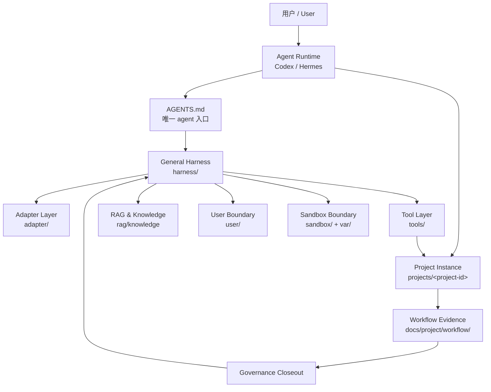
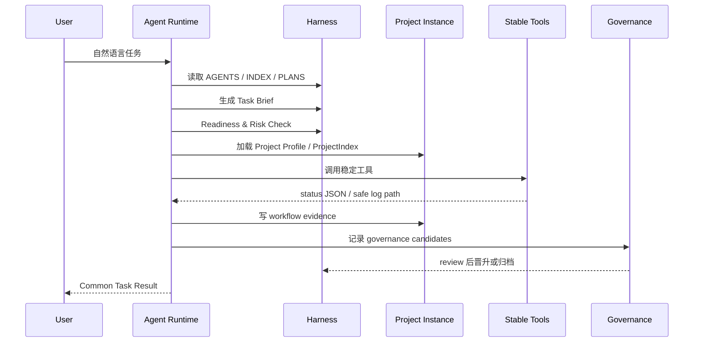
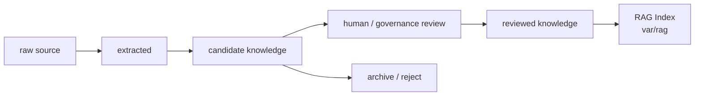
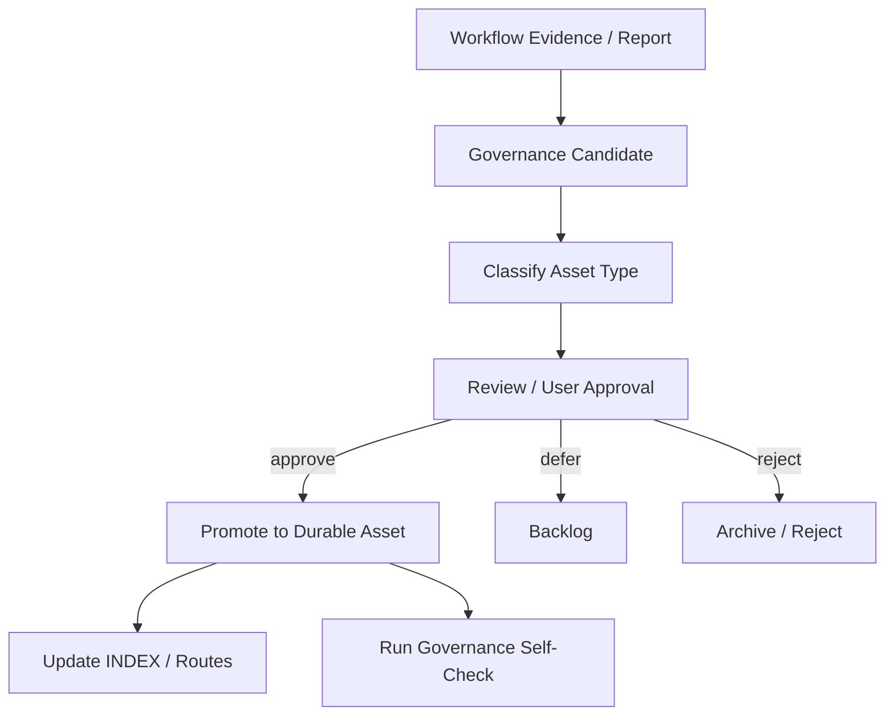

---
documentName: harness/architecture/HarnessEngineering.md
title: Harness Engineering Final Architecture
aliases:
  - HarnessEngineering
  - Harness Architecture
  - Harness 自动化框架架构
tags:
  - harness
  - architecture
  - agent
  - governance
version: v2.0.0-template-inspired-root
status: final-design-authority
updatedAt: 2026-06-12
---

# Harness Engineering 最终架构设计

## 1. 文档权威

本文是 `<HARNESS_ROOT>` 的唯一最终架构权威。旧 `harness/architecture/HarnessEngineering.md` 只保留短期兼容跳转，不再保存架构正文。

阶段状态、验收状态和下一步只记录在：

```text
harness/PLANS.md
```

长期资产路由只记录在：

```text
harness/INDEX.md
```

报告和 workflow evidence 可以提出架构变更建议，但不能替代本文。架构变更必须更新本文，并同步索引、计划和治理自检。

## 2. 核心定义

Harness 是面向智能体运行时，英文 Agent Runtime，的通用文档系统知识库、项目自动化控制层、工具资产层和治理层。

Agent Runtime，例如 Codex、Hermes 或未来其他 agent，负责推理、用户交互、工具调用、文件修改、命令执行和会话管理。Harness 不实现模型内核，不接管 runtime 内部调度；Harness 定义这些 runtime 在项目自动化中的入口、边界、证据、工具和治理规则。

Harness 同时具备两种身份：

1. 通用 Harness，英文 General Harness：agent 维护和读取的通用文档系统知识库，保存架构、治理、模板、技能、记忆规则、工具说明、报告和验证规则。
2. 项目实例，英文 Project Instance：某个具体项目在 `projects/<project-id>` 下的受管工作副本，保存项目事实、项目 Profile、项目 workflow evidence 和项目级验收。

Harness 的目标不是做纯文档系统，也不是把 Agent Runtime 内核纳入本仓库。它是让 agent 可以稳定、安全、可审计地完成项目自动化工作的控制层。

## 3. 关键术语

| 中文术语 | English | 定义 |
|---|---|---|
| 智能体运行时 | Agent Runtime | Codex、Hermes 等外部执行主体。 |
| 通用 Harness | General Harness | `harness/` 下的通用文档系统和治理资产。 |
| 项目实例 | Project Instance | `projects/<project-id>` 下的项目工作副本和项目事实。 |
| 任务简报 | Task Brief | agent 从自然语言提示词整理出的任务目标、范围、验收和风险说明。 |
| 工作流证据 | Workflow Evidence | 项目级任务过程、工具调用、验证和结论证据。 |
| 治理 | Governance | 对 Knowledge、Memory、Skill、Project Fact、Template、Tool 和 Report 的 review、晋升、归档和清理机制。 |
| 知识 | Knowledge | 经 review、带来源和作用域的事实性信息。 |
| 记忆 | Memory | 可复用经验，不等同于知识或任务历史。 |
| 技能 | Skill | 可复用工作流或操作过程，不等同于知识。 |
| 检索增强生成 | RAG | Retrieval-Augmented Generation。RAG Index 是可重建检索产物，不是事实源。 |
| 工具资产 | Tool Asset | 可重复、可审计、被文档化的脚本、命令表面或工具说明。 |

## 4. 总体架构图



核心解释：

- `AGENTS.md` 是唯一 agent 入口，给出硬约束和读取顺序。
- `harness/` 是通用 Harness 文档系统，不保存真实项目事实和真实用户私有知识。
- `projects/<project-id>` 是项目事实和项目 workflow evidence 的唯一位置。
- `rag/knowledge` 是用户知识库的人类可读分层；`var/rag` 是可重建运行态。
- `user/` 是本地用户和私有配置边界，不进入默认 prompt 和 tracked docs。

## 5. 目标目录结构

```text
<HARNESS_ROOT>\
  AGENTS.md
  README.md
  adapter/
    agents/
    gateways/
    result-contracts/
    runtime-adapters/
    task-intake/
  harness/
    architecture/
    governance/
    harness/memory/
    observability/
    project-template/
      model/
    reports/
    harness/skills/
    harness/templates/
    INDEX.md
    PLANS.md
  projects/
    <project-id>/
  rag/
    rag/knowledge/
      raw/
      extracted/
      candidate/
      reviewed/
      archive/
    corpora/
    manifests/
    pipelines/
    evals/
  sandbox/
  tools/
    docs/
    external/
    manifests/
    scripts/
      stable/
      runtime/
      historical/
      candidate/
  user/
    registry/
    settings/
      maven/
  var/
  docs/
    INDEX.md
    PLANS.md
    architecture/
      HarnessEngineering.md
```

`docs/` 是短期兼容层。它只能保存跳转 stub，最终目标是删除。

## 6. 通用 Harness 与项目实例

通用 Harness 保存可复用规则和模板：

```text
harness/architecture/
harness/governance/
harness/memory/
harness/observability/
harness/project-template/
harness/reports/
harness/skills/
harness/templates/
tools/docs/
tools/scripts/
```

项目实例保存项目事实：

```text
projects/<project-id>/
  AGENTS.md
  docs/project/
    ProjectIndex.md
    ProjectProfile.yaml
    SourceLayout.md
    Validation.md
    TestStrategy.md
    SensitiveBoundaries.md
    Acceptance.md
    workflow/
    decision/
```

规则：

1. 真实项目只进入 `projects/<project-id>`。
2. 根 registry 只保存路由 metadata，不保存项目架构、源码事实、测试报告、私有 settings 路径或 git history。
3. 通用 Harness 可以提供项目模板，但模板实例化后的项目事实必须写入项目实例。
4. Harness Root 和真实项目可以使用同一个 GitHub 账号，但必须是两个仓库。

## 7. 任务生命周期



每个受管项目任务的证据链：

```text
Task Brief
-> Readiness Check
-> Execution Plan
-> Tool Invocation Evidence
-> Trace Summary
-> Validation Report
-> Failure Attribution when needed
-> Common Task Result
-> User Acceptance or Repair State
-> Governance Candidates
```

Workflow Evidence 不会自动晋升为 Project Fact、Knowledge、Memory 或 Skill。

## 8. Adapter Layer

`adapter/` 是用户、gateway 和 Agent Runtime 的交互适配层。

它包含：

- `adapter/task-intake/`：自然语言到 Task Brief 的接入模型。
- `adapter/runtime-adapters/`：Codex、Hermes 等 runtime 的执行契约。
- `adapter/gateways/`：WeCom 等外部入口。
- `adapter/result-contracts/`：最终回复和证据路径契约。
- `adapter/agents/`：agent 约束、profile、prompt 和 policy 辅助资产。

Adapter 只定义交互和契约，不实现 agent runtime 内核。

## 9. Tool Layer

`tools/` 是供 agent 使用的工具层。

```text
tools/scripts/stable/
tools/scripts/runtime/
tools/scripts/historical/
tools/scripts/candidate/
tools/docs/
tools/external/
tools/manifests/
```

稳定工具，英文 Stable Tools，必须具备：

- documented inputs；
- documented outputs；
- status JSON 或等价 summary；
- redacted log path；
- sensitive handling；
- failure mode；
- repair suggestion。

私有 Maven settings、auth 文件和 credential 只能通过 `user/settings/` 下的本地边界被工具使用，不能被打印或写入 tracked docs。

## 10. User Boundary

`user/` 是本地用户信息和私有配置边界。

```text
user/
  registry/
    projects.local.json
    projects.local.example.json
  settings/
    maven/
      java-maven.local.json
      settings-sandbox.xml
```

规则：

1. `user/settings/**` 默认不进入 Git。
2. `user/registry/*.local.json` 默认不进入 Git。
3. 文档可以记录 profile ID 和 redacted summary，不能记录 settings XML 正文、server 用户名、密码、token、auth 文件或真实私有仓库细节。
4. 本机绝对路径、GitHub 账号信息、私有仓库 URL、私有 Maven 仓库、auth 配置和本地 settings 都属于用户边界。

## 11. Knowledge 与 RAG

`rag/knowledge` 是用户知识库的人类可读分层：

```text
rag/knowledge/raw/
rag/knowledge/extracted/
rag/knowledge/candidate/
rag/knowledge/reviewed/
rag/knowledge/archive/
```

Knowledge 生命周期：



RAG Index 是从 reviewed Knowledge、Project Facts 和 approved metadata 重建的检索产物，不是事实来源。

第一阶段离线 structured ingestion 候选仍是：

```text
MarkItDown + RapidOCR + Whisper
```

该组合只负责把原始非结构化数据转成 Markdown、metadata manifest、extraction report 和 chunks JSONL。它不负责知识 review，不代表 vector store 已选择。

## 12. Memory 与 Skill

Memory，中文解释是记忆，是经验，不是知识，也不是任务历史。

Memory 状态：

```text
candidate -> reviewed -> archived
```

Skill，中文解释是技能，是可复用工作流或操作过程，不是事实知识。

Skill 状态：

```text
candidate -> reviewed -> archived
```

更新规则：

1. agent 可以提出 candidate Memory 或 candidate Skill。
2. reviewed Memory 和 reviewed Skill 必须经用户明确批准或治理 review。
3. 项目事实优先于 Memory。
4. 过期或冲突 Memory 必须 review，不得静默复用。
5. 一次性 workflow evidence 不会自动变成 Memory 或 Skill。

## 13. Governance Runtime

Governance Runtime，中文解释是治理运行机制，负责资产的检查、报告、审查、晋升、归档和清理。



治理候选类型：

```text
ProjectFact
Knowledge
Memory
Skill
Tool
Template
Governance
Architecture
Report
RAG
```

默认规则：

- cleanup 和 promotion 默认 dry-run；
- durable changes 之前 report-first；
- Knowledge、Memory、Skill、Project Fact 晋升需要 review；
- archived reports 默认不进入上下文；
- 不整包复制旧 HarnessVault；
- 不批量删除长期资产；
- stale assets 进入 review，不静默信任。

## 14. Observability 与 Verification

Harness 记录 trace summary，不记录 raw runtime transcript。

Trace summary 应包含：

```text
taskId
traceId
runtime
channel
status
entry docs
policy docs
project docs
operation events
tool summaries
files changed
validation result
failure summary
promotion candidates
sensitive handling
```

Failure Attribution，中文解释是失败归因，应区分：

```text
model
context
tool
execution
lifecycle
verification
governance
project-fact
user-input
external
```

Validation，中文解释是验证，不只是项目测试。它还验证入口、路由、安全、证据、工具、治理和结果契约。

## 15. Sandbox 与 Runtime State

`sandbox/` 保存沙盒环境、隔离策略、profile 和 settings boundary 说明。

`var/` 保存运行态：

```text
var/logs
var/tmp
var/homes
var/m2
var/cache
var/evidence
var/rag
```

运行态默认不是稳定事实。可以在脱敏报告或 workflow evidence 中引用安全路径和摘要，但不要粘贴 raw logs、auth、settings 正文或 credential-like 内容。

## 15.1 Git 管理边界

Harness Root 应作为独立 Git 仓库管理，但创建仓库、配置 remote、提交和推送都需要用户明确批准。

可以进入 Harness Root Git 的资产：

- `AGENTS.md`、`README.md`；
- `harness/` 下的架构、治理、模板、观测、报告和模型文档；
- `adapter/`、`tools/docs/`、`tools/scripts/stable/`；
- reviewed 的 helper scripts 和非敏感 examples；
- `rag/` 下的 policy、manifest example、pipeline/eval 模板；
- `user/` 下不含真实值的 example 或 README。

不得进入 Harness Root Git 的资产：

- `var/`；
- `user/settings/`、`user/github/`、`user/auth/`、`user/registry/*.local.json`；
- `tools/external/`；
- `projects/*/`；
- 本机绝对路径、真实 GitHub 账号、私有仓库 URL、credential helper 状态、token、password、secret 和 auth 文件。

真实项目进入 `projects/<project-id>` 后，项目代码仓库仍然是独立 Git 仓库。它可以使用同一个 GitHub 账号管理，但不得与 Harness Root 混用 git history。

## 16. Obsidian-Friendly 文档系统

Harness 可以作为轻量 Obsidian vault 风格的 Markdown 文档系统管理，但 Obsidian 不是事实源。

推荐：

- Markdown frontmatter 保存 documentName、title、aliases、tags、status、version；
- 内部文档可以使用 wikilink；
- 架构和流程使用 Mermaid；
- 后续可按需使用 Obsidian Bases、Canvas 或 CLI skill；
- `harness/templates/` 是唯一模板源。

禁止默认读取或提交为事实源：

```text
.obsidian/workspace.json
.obsidian/workspace-mobile.json
.obsidian/workspaces.json
.obsidian/graph.json
.obsidian/plugins/**/main.js
.obsidian/plugins/**/styles.css
.obsidian/plugins/**/obsidian_askpass.sh
```

轻量 `.obsidian` 配置是否跟踪需要单独 review。默认不创建完整 `.obsidian` vault 配置。

## 17. Legacy HarnessVault 吸收规则

旧 HarnessVault 的价值在于：

- 中文说明和专业术语声明；
- Mermaid 架构表达；
- 通用 Harness 与 Project Harness Instance 分离；
- Knowledge、Memory、Skill 和 Governance 的生命周期；
- Obsidian/Git 边界；
- project-template 组织；
- RAG intake 与 knowledge promotion；
- report-first governance；
- trace、failure attribution 和 validation cases。

吸收规则：

1. 选择性重写，永不整包复制。
2. 旧实际目录和文件内容事实优先于旧单体架构文档叙述。
3. raw reports、`.obsidian` workspace、cache、index、未脱敏日志、真实用户知识、auth/settings/credentials 不迁入。
4. 可复用思想进入当前目标资产；历史路径不成为当前路由。

## 18. 长期落地基线

Harness Root 的长期落地基线是：

- `harness/architecture/HarnessEngineering.md` 是唯一架构权威；
- `docs/` 只剩兼容 stub；
- `adapter/`、`harness/`、`projects/`、`rag/`、`sandbox/`、`tools/`、`user/`、`var/` 分层清晰；
- 稳定工具路径使用 `tools/scripts/stable/`；
- 用户和私有配置进入 `user/` 边界；
- RAG knowledge 进入 `rag/knowledge/`；
- governance self-check 通过；
- 真实业务项目只作为受管 Project Instance 进入 `projects/<project-id>`；
- RAG 工具、vector store 和 `.obsidian` 运行配置都按阶段 review 后落地；
- 旧 HarnessVault 只选择性重写吸收，不整目录迁入。

满足以上基线不等于 Harness 已生产化完成。真实项目 onboarding、RAG structured ingestion PoC、统一 CLI、强隔离和 live gateway validation 仍需要按 `harness/PLANS.md` 分阶段验证。
