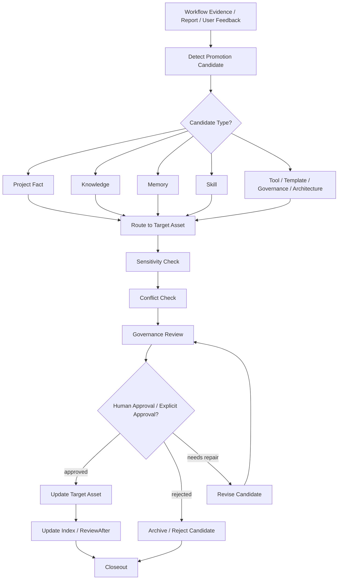

# Artifact Lifecycle

本文定义 Harness 资产生命周期。Workflow Evidence、Report、RAG chunks、Trace Summary 和运行态输出只产生候选，不自动成为长期事实或长期能力。

## 1. 通用生命周期



## 2. Candidate 类型

| 类型 | 默认目标 |
|---|---|
| `ProjectFact` | `projects/<project-id>/docs/project/` |
| `Knowledge` | `user/knowledge/candidate/`，review 后进入 `user/knowledge/reviewed/` 或外部 private repo。 |
| `Memory` | `harness/memory/candidate/`，review 后进入 `harness/memory/reviewed/`。 |
| `Skill` | `harness/skills/candidate/`，review 后进入 `harness/skills/reviewed/`。 |
| `Tool` | `harness/tools/` 中对应 tool asset。 |
| `Template` | `harness/templates/` 中对应模板。 |
| `Governance` | `harness/governance/` 中对应 policy。 |
| `Architecture` | `harness/architecture/HarnessEngineering.md`，必须用户明确批准。 |
| `Report` | `harness/reports/` 或项目 reports。 |
| `RAG` | 机制进入 `harness/rag/`；运行态进入 `var/rag/`；知识正文进入 `user/knowledge/`。 |

## 3. Closeout 记录

任务收口使用：

```text
harness/templates/governance/GovernanceCloseoutTemplate.md
```

每个 candidate 必须记录 source evidence、target asset、disposition、approval requirement、sensitive risk 和 next action。

## 4. 禁止自动晋升

不得直接晋升 workflow evidence、report conclusion、RAG chunks、runtime logs、status JSON 正文、old raw vault files、settings、auth、credentials 或 private repository paths。
