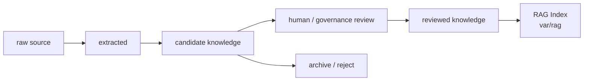

# Knowledge Promotion Policy（知识晋升策略）

本文定义 raw source 如何成为 candidate knowledge、reviewed knowledge，以及 reviewed source 如何重建 RAG index。RAG Index 是可重建检索产物，不是事实源。

## 1. Knowledge Promotion Flow



## 2. 资产位置

| 状态 | 目标位置 | 边界 |
|---|---|---|
| raw source | `user/knowledge/raw/<domain>/` 或外部 private repo | local-only / private；最终 reviewed vault 必须按 domain/source 收口 |
| normalized source markdown | `user/knowledge/raw/<domain>/normalized/` 或外部 private raw source boundary | 原始材料转换后的长期可读派生版本；不是 reviewed 结论，但可作为 Source Trace 的稳定来源 |
| extracted artifacts | `var/rag/<run-id>/extracted/` | runtime，可重建 |
| candidate knowledge | `user/knowledge/candidate/<run-id>/wiki` | local-only / private，等待 review |
| eval reports | `var/rag/<run-id>/evals/` | runtime，可重建 |
| graph / embedding / index / cache | `var/rag/<run-id>/` | runtime，可重建 |
| reviewed knowledge | `user/knowledge/reviewed/` 或外部 private repo | 需要 human review 或用户明确批准 |
| RAG mechanism | `harness/rag/` | 通用机制，不保存真实知识正文 |

## 3. 晋升规则

晋升到 reviewed Knowledge 必须满足：

1. source provenance 清晰；
2. scope 明确：`global`、`domain`、`project-reviewed` 或用户私有 scope；
3. sensitivity check 通过；
4. 外部材料具备 usage-rights 或 copyright risk 判断；
5. 与 Project Facts 和 existing Knowledge 完成 conflict check；
6. human review 或用户明确批准；
7. 记录 reviewer、review date 和 staleness rule。
8. source-level reviewed page 必须有足够的中文主体综合内容，至少覆盖 source overview、core framework、key concepts、applicability、non-applicability 和 source trace；不能只保留关键词、概念名或一两句摘要。
9. 如果存在原始材料转换后的 Markdown，它必须长期保存到 `raw/<domain>/normalized/` 或外部 private raw source boundary；reviewed `sourceRefs` 不应依赖 `var/rag/<run-id>/extracted/*.md`。

## 4. 工具支持边界

raw-to-candidate Skill 可以通过稳定工具生成审核材料：

```text
harness/tools/scripts/stable/invoke-rag-candidate.ps1 -Command review-package
harness/tools/scripts/stable/invoke-rag-candidate.ps1 -Command promotion-plan
harness/tools/scripts/stable/invoke-rag-candidate.ps1 -Command promote-reviewed
harness/tools/scripts/stable/invoke-rag-knowledge.ps1 -Command promote-gap-candidates
harness/tools/scripts/stable/invoke-rag-knowledge.ps1 -Command dispose-residual-gaps
harness/tools/scripts/stable/invoke-rag-knowledge.ps1 -Command canonicalize-vault-layout
harness/tools/scripts/stable/invoke-rag-knowledge.ps1 -Command validate-knowledge-vault
harness/tools/scripts/stable/invoke-rag-knowledge.ps1 -Command candidate-cleanup-plan
harness/tools/scripts/stable/invoke-rag-knowledge.ps1 -Command govern-reviewed-duplicates
harness/tools/scripts/stable/invoke-rag-knowledge.ps1 -Command pipeline-smoke
```

规则：

1. `review-package` 只汇总 candidate provenance、validation state、page inventory 和 review gates。
2. `promotion-plan` 只生成目标 scope、目标路径、pre-promotion gates 和 approval blockers。
3. `review-package` 和 `promotion-plan` 都不得写入 reviewed Knowledge。
4. `promote-reviewed` 只有在 review gates 通过且 human review 或用户明确批准后才能写入 reviewed Knowledge。
5. reviewed Knowledge 写入必须记录 reviewer、review date、approval note、reviewAfter、source trace 和 promotion result。
6. `promote-gap-candidates` 只处理 reviewed gap review package 中已经通过用户批准的 approved concept；`dedup-before-promotion`、`revise-before-review` 或缺少 evidence 的项不得自动晋升。
7. `dispose-residual-gaps` 只处置已知 workflow / mechanism residual gap：允许把 reviewed wikilink 改为 policy / Skill / template 机制引用，并在 candidate page 上记录 disposition；不得执行 reviewed Knowledge promotion。
8. `canonicalize-vault-layout` 只做 local-only vault 结构治理：把 raw、candidate archive、reviewed domain、schema、authoritative page 和 validation evidence 收敛到 source-centered 结构；不得新增 reviewed Knowledge promotion。
9. `validate-knowledge-vault` 只执行一键只读验证门禁：检查 registry、Home、domain schema、reviewed frontmatter、source trace、broken links、duplicate source、archive reference、Git ignore 和 plugin boundary；不得执行 reviewed Knowledge promotion 或重排 vault。
10. `candidate-cleanup-plan` 只生成 post-promotion cleanup dry-run report：盘点 candidate full corpus、轻量审计记录和 reviewed/Home/registry 引用；不删除、不移动、不改写 reviewed source trace。
11. `pipeline-smoke` 只能作为端到端验证命令使用；它必须要求 reviewer、approval note、raw input 和 query，并且 promotion 仍由 `promote-reviewed` 门禁执行。
12. `govern-reviewed-duplicates` 只检查和报告重复治理结果；同 raw source / topic 只能有一个 authoritative reviewed page，其余必须标记为 validation evidence、superseded、archived 或 deprecated。
13. 正式 reviewed page 必须使用语义命名；`smoke`、`pipeline`、阶段编号或工具 run id 只能作为 validation evidence、candidate archive 或 runtime report 的名称。
14. Obsidian LLM Wiki 类插件只能生成 candidate evidence、阅读视图或本地治理线索；插件输出写入 reviewed Knowledge 必须重新走本 Policy 的 review gates 和 explicit approval。
15. LLM Wiki 类工具中的 schema config、extraction granularity、tag vocabulary、source gate、source fingerprint、alias-aware dedup、repair order 和 graph retrieval 只能作为 Harness 机制输入；不能绕过 candidate-first 和 review-first 边界。
16. Candidate 晋升、拒绝或归档后，full corpus 默认应移出 Obsidian 默认图谱或删除，只保留轻量审计记录；实际删除或移出 vault 必须先通过 dry-run report 和用户批准。
17. `validate-knowledge-vault` 必须阻止 authoritative reviewed page 把 `var/rag/<run-id>/extracted/*.md` 作为长期 `sourceRefs`；这些路径只能作为 runtime reproduction evidence 出现在运行态 report 中。

## 5. 禁止路径

```text
raw log -> reviewed Knowledge
RAG chunk -> source of truth
var/rag extracted markdown -> long-term reviewed sourceRef
agent guess -> reviewed Knowledge
workflow evidence -> reviewed Knowledge without review
private settings -> any knowledge asset
candidate wiki -> reviewed Knowledge without explicit approval
duplicate reviewed pages -> multiple authoritative pages
residual workflow gap -> reviewed Knowledge from unrelated raw source
smoke or pipeline run id -> authoritative reviewed page name
plugin output -> reviewed Knowledge without review
plugin config or query history -> tracked Harness docs
post-promotion full candidate corpus -> permanent Obsidian graph node without audit decision
LLM Wiki auto maintenance -> direct reviewed Knowledge write
```
