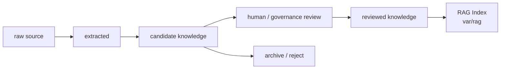

# Knowledge Promotion Policy（知识晋升策略）

本文定义 raw source 如何成为 candidate knowledge、reviewed knowledge，以及 reviewed source 如何重建 RAG index。RAG Index 是可重建检索产物，不是事实源。

## 1. Knowledge Promotion Flow



## 2. 资产位置

| 状态 | 目标位置 | 边界 |
|---|---|---|
| raw source | `user/knowledge/raw/<run-id>/` 或外部 private repo | local-only / private |
| extracted artifacts | `var/rag/<run-id>/extracted/` | runtime，可重建 |
| candidate knowledge | `user/knowledge/candidate/<run-id>/wiki` | local-only / private，等待 review |
| eval reports | `var/rag/<run-id>/evals/` | runtime，可重建 |
| graph / embedding / index / cache | `var/rag/<run-id>/` | runtime，可重建 |
| reviewed knowledge | `user/knowledge/reviewed/` 或外部 private repo | 需要 human review 或用户明确批准 |
| RAG mechanism | `harness/rag/` | 通用机制，不保存真实知识正文 |

## 3. 晋升规则

晋升到 reviewed Knowledge 必须满足：

1. source provenance 清晰；
2. scope 明确：`global`、`domain`、`project-reviewed` 或用户私有 scope；
3. sensitivity check 通过；
4. 外部材料具备 usage-rights 或 copyright risk 判断；
5. 与 Project Facts 和 existing Knowledge 完成 conflict check；
6. human review 或用户明确批准；
7. 记录 reviewer、review date 和 staleness rule。

## 4. 禁止路径

```text
raw log -> reviewed Knowledge
RAG chunk -> source of truth
agent guess -> reviewed Knowledge
workflow evidence -> reviewed Knowledge without review
private settings -> any knowledge asset
candidate wiki -> reviewed Knowledge without explicit approval
```
