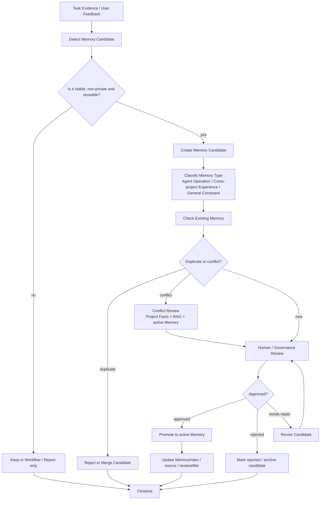

# Memory Policy（记忆策略）

Memory 是小而稳定、未来可复用、已经通用化的经验。Memory 不区分用户 Memory 和通用 Memory；不够通用或包含用户私有偏好的内容不得晋升为长期 Memory。

## 1. 适合进入 Memory 的内容

- 多个项目或多次任务可复用的经验；
- Agent 操作注意事项；
- 跨任务复用的失败解决经验；
- 经审查的候选记忆；
- 对通用 Harness 使用有帮助的非私有经验。

## 2. 不适合进入 Memory 的内容

- 大段日志、代码、任务 transcript 或一次性 TODO；
- 未验证推测；
- 外部知识长文；
- 已写入 Project Facts 或 reviewed Knowledge 的完整内容；
- 用户信息、本机信息、私有 settings 或 credentials；
- 不具备通用性的用户偏好。

## 3. Memory Update Flow



## 4. 冲突优先级

```text
用户当前明确指令
> Project Fact / 正式文档
> reviewed Knowledge / RAG
> active Memory
> candidate Memory
> archived Memory
```

当 Memory 与正式文档冲突时，应报告冲突，由用户审批决策，不得静默覆盖。
