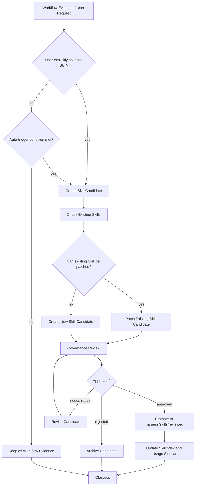

# Skill Policy（技能策略）

Skill 是可复用工作流或程序性记忆，描述“在什么条件下，Agent 应如何执行一类任务”。

## 1. 创建或更新触发条件

只有满足以下条件之一，才建议创建或更新 Skill：

1. 同类任务重复出现 5 次以上；
2. 某次任务产生明确、可复用的执行流程；
3. 用户纠正了智能体错误做法，且该纠正未来会复用；
4. 某个操作有稳定验收步骤；
5. 某个脚本、模板、checklist 已稳定；
6. 某个调试或分析流程具有跨项目价值。

## 2. Skill Creation Flow



## 3. 晋升规则

新 Skill 必须满足：

1. 同类任务已经重复出现，或用户明确要求沉淀；
2. 现有 Skill 无法覆盖；
3. 内容是可复用流程，不是单次上下文；
4. 有明确触发条件；
5. 有可验证步骤和验收标准；
6. 已更新 `harness/skills/SkillIndex.md`；
7. 已通过 Human Owner 审查或用户明确批准。

## 4. Usage Sidecar

动态统计不写入 `SKILL.md` frontmatter，避免每次使用 Skill 都修改正式文档。

动态统计放在：

```text
harness/skills/usage/skill-usage.json
```

`skill-usage.json` 可以记录：

```json
{
  "skillId": "architecture-design",
  "useCount": 12,
  "patchCount": 3,
  "lastUsedAt": "...",
  "lastPatchedAt": "...",
  "successRate": "...",
  "staleCandidate": false
}
```

## 5. 禁止内容

Skill 不得保存一次性任务记录、项目事实、临时日志、未验证猜测、大段外部知识、用户个人偏好、大段代码、临时路径或没有触发条件和验收方式的经验总结。
