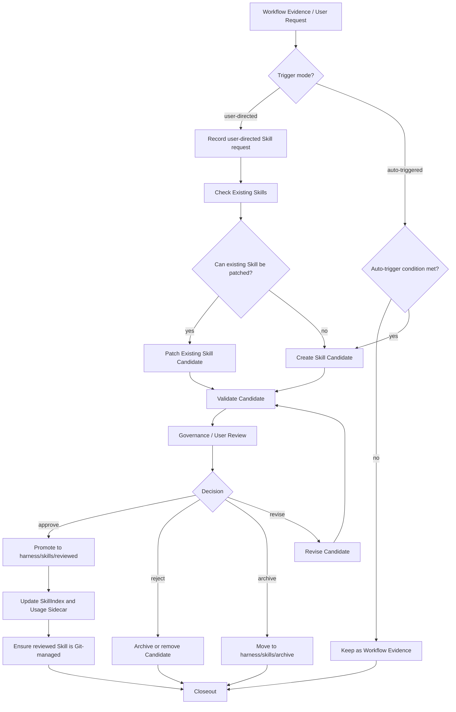

# Skill Policy（技能策略）

Skill 是可复用工作流或程序性记忆，描述“在什么条件下，Agent 应如何执行一类任务”。

## 1. 创建或更新触发模式

Skill 创建或更新有两类入口，必须区分记录：

| 触发模式 | 定义 | 处理要求 |
|---|---|---|
| 用户指定触发 | 用户明确要求沉淀、创建、修订、审核或晋升某个 Skill。 | 记录为 user-directed flow；仍需先检查已有 Skill、进入 candidate 或 patch candidate，并等待用户或治理 review。 |
| 自动触发 | Agent 根据重复任务、稳定流程或纠错经验判断可能需要沉淀 Skill。 | 记录为 auto-triggered candidate；不得直接晋升 reviewed。 |

用户指定触发不是自动化 Skill 创建过程，也不等于允许绕过 candidate、review 和 Git 管理门禁。

## 2. 创建或更新触发条件

只有满足以下条件之一，才建议创建或更新 Skill：

1. 同类任务重复出现 5 次以上；
2. 用户明确要求沉淀、创建、修订或审核 Skill；
3. 某次任务产生明确、可复用的执行流程；
4. 用户纠正了智能体错误做法，且该纠正未来会复用；
5. 某个操作有稳定验收步骤；
6. 某个脚本、模板、checklist 已稳定；
7. 某个调试或分析流程具有跨项目价值。

## 3. Skill Creation Flow



## 4. 晋升规则

新 Skill 必须满足：

1. 同类任务已经重复出现，或用户明确要求沉淀；
2. 现有 Skill 无法覆盖；
3. 内容是可复用流程，不是单次上下文；
4. 有明确触发条件；
5. 有可验证步骤和验收标准；
6. 已更新 `harness/skills/SkillIndex.md`；
7. 已通过 Human Owner 审查或用户明确批准。

晋升为 reviewed Skill 后必须完成：

1. reviewed 文件位于 `harness/skills/reviewed/<skill-name>/` 或治理批准的 reviewed 分类路径；
2. candidate 路径不再保留同名活跃 Skill 文件，避免重复路由；
3. `SkillIndex.md` 指向 reviewed 路径；
4. `harness/skills/usage/skill-usage.json` 记录状态、最近使用、最近修订和晋升决策；
5. 审核包或阶段记录保存 approve、reject、archive 或 revise 的最终决策；
6. reviewed Skill 进入 Git 管理，不允许作为未跟踪文件遗留。

## 5. Git 管理门禁

reviewed Skill 是 Harness 长期资产，必须受仓库管理：

1. `SKILL.md`、`agents/openai.yaml` 和必要资源文件必须能被 `git status` 识别为 tracked 或 staged；
2. 如果 `.gitignore` 阻止 reviewed Skill 入库，必须先修正忽略规则或记录用户决策；
3. 晋升收口时必须用限定路径执行 `git add`，只纳入本次 Skill 晋升相关文件；
4. 不得把 raw logs、原始数据、私有 settings、auth、token、本机绝对路径或未脱敏项目事实随 Skill 一起纳入 Git；
5. 若工作区存在无关变更，必须保留它们，不得顺手 stage、revert 或混入 Skill 收口。

## 6. Usage Sidecar

动态统计不写入 `SKILL.md` frontmatter，避免每次使用 Skill 都修改正式文档。

动态统计放在：

```text
harness/skills/usage/skill-usage.json
```

`skill-usage.json` 可以记录：

```json
{
  "skillId": "architecture-design",
  "useCount": 12,
  "patchCount": 3,
  "lastUsedAt": "...",
  "lastPatchedAt": "...",
  "successRate": "...",
  "staleCandidate": false
}
```

## 7. 禁止内容

Skill 不得保存一次性任务记录、项目事实、临时日志、未验证猜测、大段外部知识、用户个人偏好、大段代码、临时路径或没有触发条件和验收方式的经验总结。
